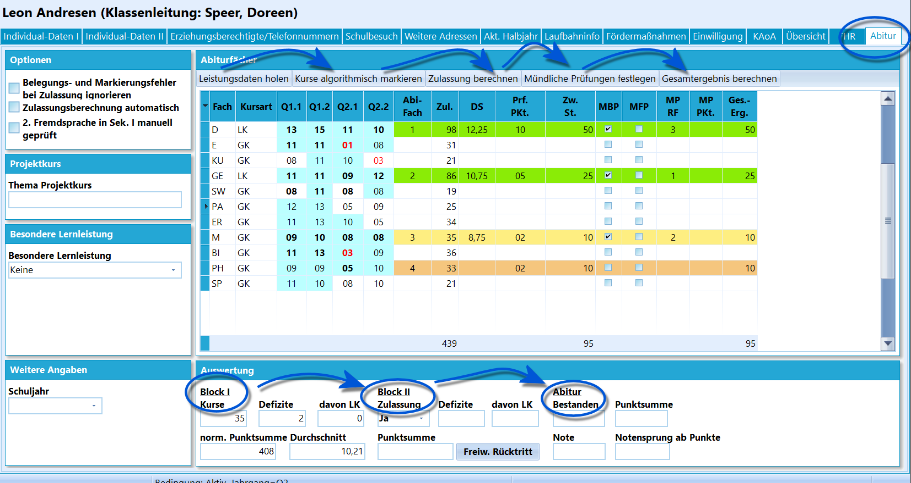

# Abitur (Schüler)

Wurden Schüler aus der Q-Phase ausgewählt, steht der Reiter **Abitur**
unter *Schüler* zur Verfügung.

Dieser Artikel ist eine Übersicht über den Reiter
*Abitur*. Konsultieren Sie das Tutorial *Komplette Abiturberechnungen
durchführen* für eine detaillierte Erklärung der Verwendung dieses
Reiters beziehungsweise der zugehörigen Gruppenprozesse.

Der Ablauf ist, dass
-   zuerst über **Leistungsdaten holen** die Leistungsdaten geholt
    werden.
-   Anschließend werden die Kurse algorithmisch markiert, SchILD
    versucht, möglichst positive Kurse einzubringen. Anschließend wird
    mit
-   **Zulassung berechnen** eben dies getan. Das Ergebnis findet sich
    unten in der **Auswertung**.In die Berechnung der Zulassung kann noch über die **Optionen** links
eingegriffen werden.**Belegungs- und Markierungsfehler ignorieren** überschreibt hier den
Algorithmus. Dies kann in Sonderfällen nötig werden oder falls
tatsächlich im Algorithmus ein Fehler vorliegen sollte, wird das Abitur
bei der Anwahl dieses Schalters nicht blockiert.**Zulassungsberechnung automatisch** sogar dafür, dass bei einem
manuellen Setzen und Entfernen von Markierungen auf Kursen die
Zulassungsberechnung jedes mal erneut ausgeführt wird. Das Setzen und
Entfernen von Markierungen wird über einen `Doppelklick` ausgeführt.**2. Fremdsprache in der Sek. I manuell geprüft** überschreibt den
Algorithmus an dieser Stelle und nimmt das Vorliegen der 2. Fremdsprache
zwingend an. Dies kann notwendig werden, wenn ein Schüler erst zur EF
oder Q1 auf die Schule gewechselt ist und SchILD keine Daten aus der
Sek. I vorliegen.Wenn die Zulassung erreicht wurden, lassen sich die über **Prf. Pkt**
die Prüfungsergebnisse erfassen.-   Anschließend kann über **Mündliche Prüfungen festlegen** berechnet
    werden, ob das Abitur schon bestanden wurde. Falls nicht, werden die
    Haken bei **MBP** für das 1. bis 3. Abiturfach gesetzt. Eventuell
    kann ein Schüler eine freiwillige Prüfung wahrnehmen, dann ist der
    Haken bei **MFP** manuell zu setzen.<!-- -->-   Bei mehreren mündlichen Prüfungen ist nun die Reihenfolge der
    Prüfungen über *'MP RF* taktisch klug zu wählen.<!-- -->-   Die Ergebnisse der mündlichen Prüfungen werden über **MP Pkt.**
    erfasst.<!-- -->-   **Gesamtergebnis berechnen** stößt die Berechnung des
    Gesamtergebnisses, also **Abitur Bestanden**, **Punktsumme** und
    **Note** an. Weiterhin wird angegeben, ab welcher Punktzahl ein
    **Notensprung** nach oben stattfinden würde.Schlussendlich lässt sich im Bereich der *Auswertung* auch der Schalter
finden, mit dem ein **Freiwilliger Rücktritt** von der Abiturprüfung
stattfindet.Auf der linken Seite kann eine **Besondere Lernleistung** eingebracht
werden. Hier wären *Art der Arbeit* (*Projektkurs* oder *externe
Arbeit*) sowie deren *Titel* und die *Note* einzugeben.

Beachten Sie, dass ein Klick auf *Leistungsdaten holen*
oder *Zulassung berechnen* alle schon später gemachten Eingaben zu den
Prüfungen ohne weitere Warnung löscht.

Die algorithmische Markierung von Kursen und die
Berechnung von Zulassung und Abiturergebnis ist als reine Unterstützung
ohne Gewähr zu verstehen. Die Gewähr der Korrektheit der Ergebnisse
entsprechend der geltenden Vorgaben obliegt der Schule.

