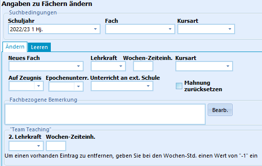
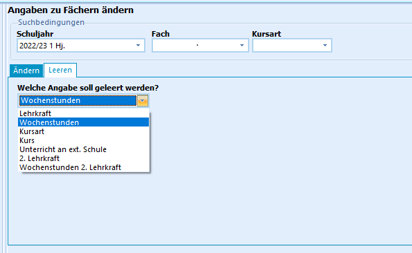

# Details zu Fächern bei Schülern ändern (Gruppenprozesse Fächer)

 Mit dem Aufruf des Gruppenprozesses **Details zu Fächern
bei Schülern ändern** erscheint das Eingabefenster, in dem Felder bei
existierenden Fächern geändert werden können.Ändern Sie zum Beispiel die *Lehrkraft*, *Wochen-Zeiteinheiten* oder die
*Kursart* eines Faches.Im Kopfbereich des Fensters sind die Angaben des zu bearbeitenden Faches
vorzunehmen.Auf der Registerkarte **Ändern** können nun zahlreiche Informationen zu
dem ausgewählten Fach bei den ausgewählten Schülern für einen beliebigen
zu wählenden Abschnitt geändert werden.Man kann sogar ein Fach, in dem bereits Noten eingegeben wurden, in ein
anderes Fach umwandeln. Die Noten werden für das neue Fach übernommen.

Die Felder, in die nichts eingetragen wurde, führen nicht zum Löschen
der Information.  

Sie können über den Reiter **Leeren** auch Felder auswählen, die
gelöscht werden.