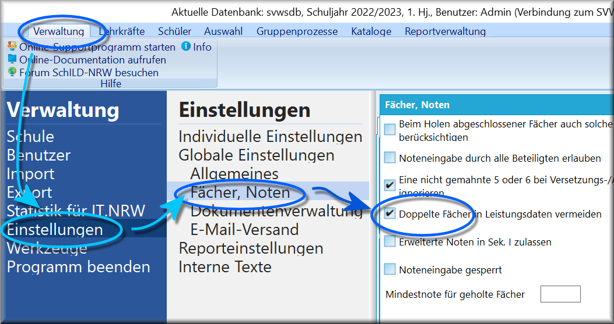

# Doppelte Fächer löschen (Gruppenprozesse Fächer)

 Mithilfe dieses Gruppenprozesses können doppelte Einträge
bei Fächern im ausgewählten Schuljahr und Abschnitt gelöscht werden.Zum doppelten Auftreten vom Fächern kann es kommen, wenn SchILD über den
Datenimport Leistungsdaten importiert.Damit dieser Gruppenprozess arbeiten kann, muss unter *Verwaltung ➜
Einstellungen ➜ Globale Einstellungen ➜ Fächer, Noten* der Haken bei
**Doppelte Fächer bei Leistungsdaten vermeiden** gesetzt sein.Nach Durchlauf des Gruppenprozesses gibt SchILD eine Meldung, wie viele
Fächereinträge entfernt wurden.