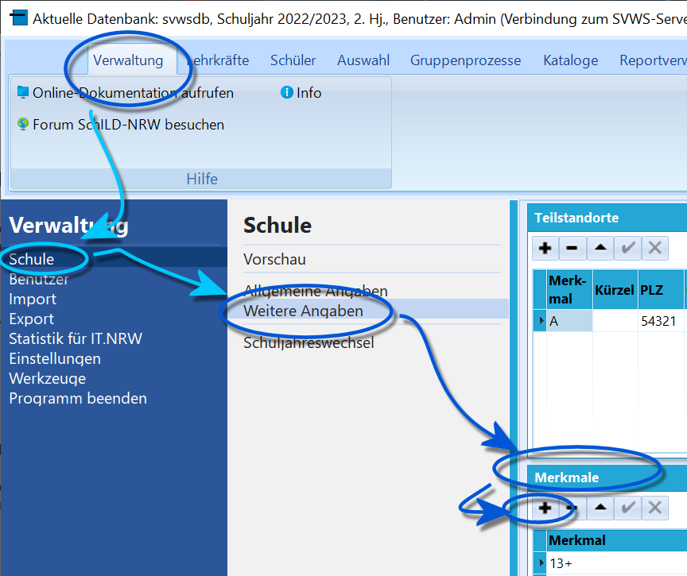

# Eintragung der Schüler im offenen Ganztag (Tutorial)

### Einstellungen für die SchuleUm Schüler im **offenen Ganztag** statistisch korrekt zu erfassen, muss
für die Schule das *Merkmal* **Offener Ganztag** gesetzt werden.Wenn gewünscht wählen sie ebenfalls *Schule von 8 bis 1* oder *Dreizehn
Plus* beziehungsweise *13+*.Bei der Wahl von *13+* tragen Sie ebenfalls die *Anzahl der Gruppen*
ein.

Diese Einstellungen finden sich unter *Verwaltung ➜ Weitere Angaben* ➜
**Merkmale**.Neue Merkmale werden über das **+** hinzugefügt.  
===Eintragung bei den Schülern=== Die Teilnahme am offenen Ganztag soll
in den *Individualdaten I* angezeigt werden.Für diesen Eintrag gehen Sie unter **Schüler** in den **Aktuellen
Abschnitt** und hier kann die **Klassen-Organisationsform** für den
gewählten Schüler gesetzt werden.

Dies geht auch mit gefilterten SuS über den *Gruppenprozess*
**Individualdaten ändern**, hier ist dann unter **Aktuelle
Laufbahndaten** die **Klassen-Organisationsform** zu wählen.Bei allen anderen Schülern tragen Sie, individuell oder gruppenweise,
*Halbtagsunterricht* ein. Dies gilt auch, wenn sie bis 13:00 bleiben.

Die *Halbtagskinder können* Sie auf andere Weise weiter differenzieren:
Die Teilnahme an *Schule von 8 bis 1* und *Dreizehn Plus* tragen Sie
unter den **Individualdaten II** in der Rubrik **Merkmale** ein.Dort tragen Sie in diesem Fall jedoch nicht *offener Ganztag* ein, auch
wenn das Feld angeboten werden sollte.Auch die *Individualdaten II* können über den Gruppenprozess
*Individualdaten ändern* auf zuvor gefilterte Schülergruppen verändert
werden.