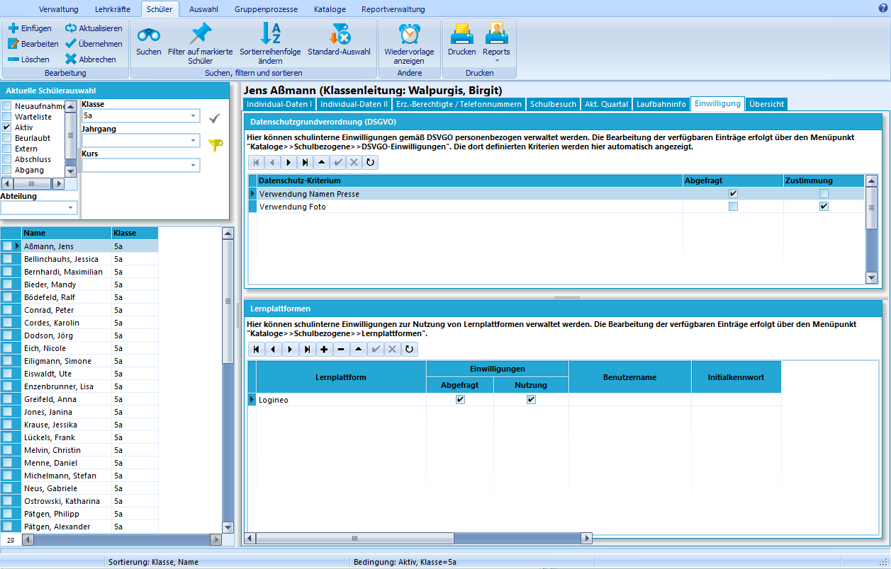
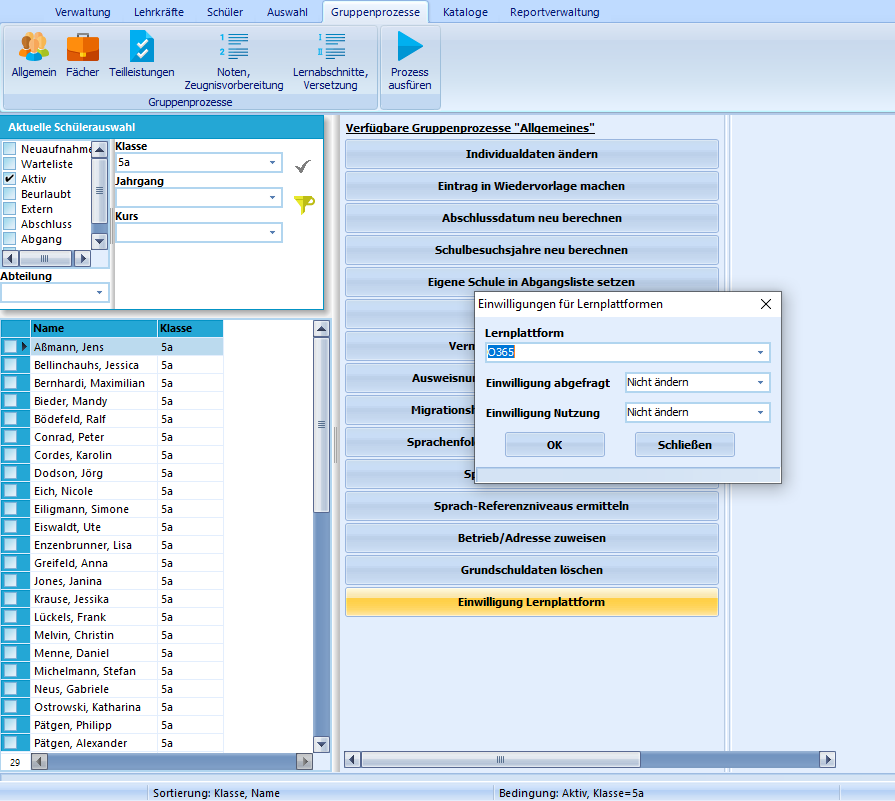

# Einwilligung (Schüler)

In diesem Reiter können für die ausgewählte Schülerin bzw. den
ausgewählten Schüler die Einwilligungen sowohl in die Nutzung
personenbezogener Daten gemäß DSGVO als auch zur Nutzung von
Lernplattformen verwaltet werden.Beide Arten von Einwilligungen werden unter den (schulbezogenen)
Katalogen verwaltet. Erst danach können sie hier für die ausgewählten
Schülerinnen und Schülern bearbeitet werden.  

## Individuelle Schülerinnen und Schüler

## Einwilligungen

 Für die in den Katalogen angelegten DSGVO-Einwilligungen
kann hier durch Setzen eines Hakens angewählt werden, ob das
entsprechende Kriterium bereits abgefragt wurde. Die Nutzung dieses
Hakens ist insbesondere für neue Schülerinnen und Schüler sinnvoll, da
so fehlende Abfragen schnell gefunden werden können.Liegt eine Zustimmung vor, so kann dort der Haken gesetzt werden.

Der Reiter kann auch zur Verwaltung von Einwilligungen
verwendet werden, die nicht mit der DSGVO zusammenhängen.

  

## Lernplattformen

Ebenso wie für die Einwilligungen kann auch für die von der Schule
verwendeten Lernplattformen die individuelle Einwilligung verwaltet
werden. Zusätzlich lassen sich (in Zukunft) Benutzernamen und
Initialpasswörter direkt in SchILD generieren und für einen Export zu
der jeweiligen Lernplattform nutzen.  

## Gruppenprozesse

 Für ganze Klassen, Jahrgänge oder andere Gruppen von
Schülerinnen und Schülern können die Einwilligungn auch per
Gruppenprozess setzen. Zustäzlich zur Auswahl, ob die Abfrage oder
Einwilligung bejaht oder verneint wird, kann hier auch keine Änderung
der bestehenden Daten erfolgen, wie das Beispiel zeigt. So kann auch nur
eine der beiden Möglichkeiten, Abfrage oder Einwilligung, per
Gruppenprozess geändert werden.