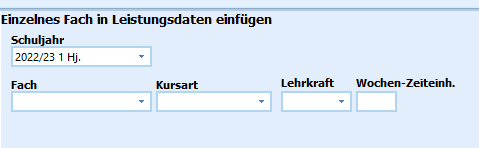

# Einzelne Fächer bei Schülern hinzufügen (Gruppenprozesse Fächer)

 Mit dem Aufruf des Gruppenprozesses **Einzelne Fächer bei
Schülern hinzufügen** erscheint das Eingabefenster, über das sich dies
bewerkstelligen lässt.

Dieser Gruppenprozess ermöglicht das Ergänzen eines einzelnen Faches im
jeweils ausgewählten Schuljahr und Abschnitt bei der selektierten
Schülergruppe.Wählen Sie den **Lernabschnitt**, das **Fach**, die **Kursart**,
**Lehrkraft** und die **Wochen Zeiteinheiten**.Hier sollte auf vollständige Eingaben geachtet werden, da diese Angaben
sonst später nachgetragen werden müssen.