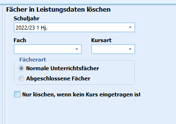

# Einzelne Fächer bei Schülern löschen (Gruppenprozesse Fächer)

 Mit dem Aufruf des Gruppenprozesses **Einzelne Fächer bei
Schülern löschen**, mit dem sich Fächer bei Schülergruppen löschen
lassen.

Dieser Gruppenprozess ermöglicht das Löschen ganzer Unterrichtsfächer im
jeweils ausgewählten Schuljahr und Abschnitt bei der selektierten
Schülergruppe.

Das Häkchen, das ganz unten gesetzt werden kann, verhindert das
versehentliche Löschen von Fächern, in denen Kurse zugewiesen sind. Ist
das Häkchen gesetzt, werden nur Fächer ohne Kurseintrag gelöscht.