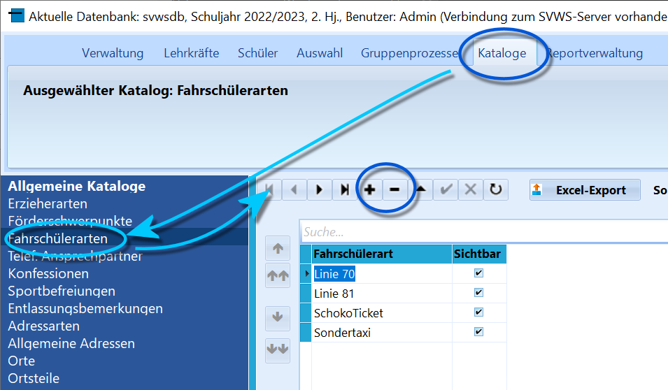

# Fahrschüler-Arten (Allgemeine Kataloge)

 Über *Kataloge* ➜ **Fahrschülerarten** können die
unterschiedlichen Arten, wie Schüler den per ÖPNV oder nach anderen
Sonderregeln organisierten gefahrenen Schulweg zurücklegen.Wie in Katalogen üblichen sind Einträge über das "**+**" und "**-**" zu
setzen beziehungsweise zu entfernen.Der Eintrag wird dann in den *Individualdaten I* unter *Zusatzdaten*
gesetzt und es kann über den *Filter I* auf diese Fahrschülerarten
gefiltert werden.