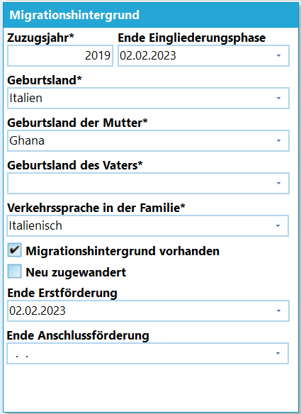
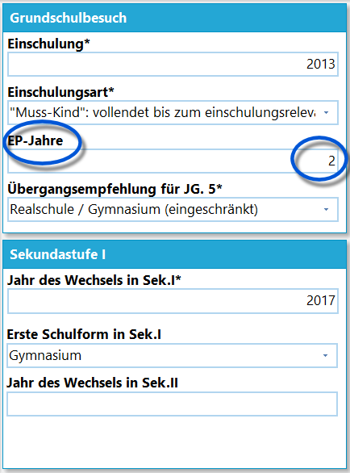
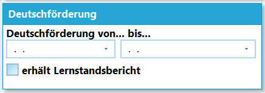
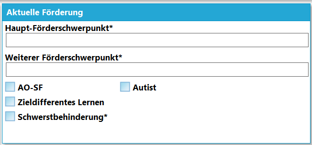
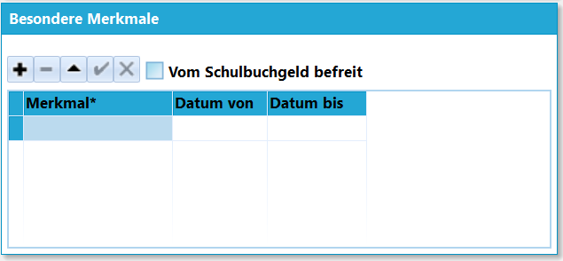

# Individualdaten II (Schüler)

In den *Individualdaten II* werden Informationen zur
Einwanderungsgeschichte, dem Schulbesuch und sonderpädagogischen
Förderungen eines Schülers erfasst.

## Migrationshintergrund

 Wurde der Haken gesetzt, dass ein **Migrationshintergrund
vorhanden** ist, können die Daten hier nun erfasst werden.Beachten Sie die statistikrelevanten Felder, die durch den "**\***"
kenntlich gemacht werden.Weiterhin können Daten zu *Erst-* und *Anschlussförderung* aufgenommen
werden.Nehmen Sie an dieser Stelle das Tutorial zur 

WIKILINK: Eingabe_von_Flüchtlingskindern_(Tutorial)
zur Kenntnis.  

## Je nach Schulform weitere Felder

Abhängig von der Schulform können weitere Abschnitte eingeblendet
werden.

Hier im Beispiel wird der *Grundschulbesuch* mit
eingeblendet. Bei diesem ist zu beachten, dass der Verbleib in der
Schuleingangs-Phase korrekt eingetragen wird, damit das Ende der
Schulpflicht korrekt berechnet wird. War ein Kind drei Jahre in der
EP-Phase, in SchILD stehen aber die zwei als Standardangabe, wäre die
automatische Berechnung des Schulpflicht-Endes um das eine Jahr
fehlerhaft.

Ebenso erscheinen hier an *Berufskollegs* ein Bereich für das

**Einschulungsjahr**, die **BKAZVO-Anrechungszeit (Monate)** und die
**Berufsqualifikation** auf.

## Aktuelle Förderung und Deutschförderung

 Im Fenster *Deutschförderung* ist *Beginn und*Ende*von
dieser einzutragen, ebenso, ob der Schüler
einen*Lernstandsbericht*erhält.  

 Unter dem Punkt*aktuelle Förderung'' können folgende Daten
erfasst werden:-   **Hauptförderschwerpunkt**
-   **Weiterer Förderschwerpunkt**Weiter können *AO-SF*, *Zieldifferentes Lernen*, *Schwerstbehinderung*
oder *Autist* erfasst werden. Die Erfassung der *Schwerstbehinderung*
ist statistikrelevant.

## Besondere Merkmale

 Hier können auf individueller Basis Merkmale zugeordnet
werden. Es können nur Merkmale gewählt werden, die unter *Verwaltung*
für die *Schule* unter *Weitere Angaben* als Merkmal eingestellt wurden.