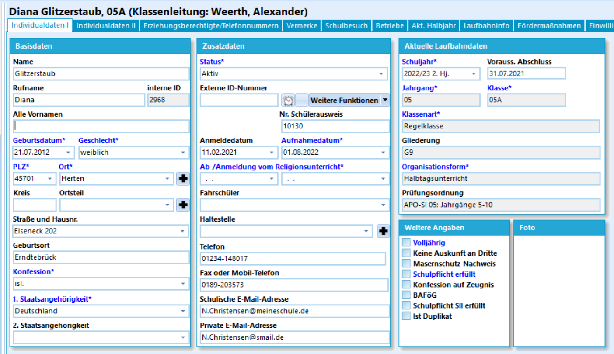
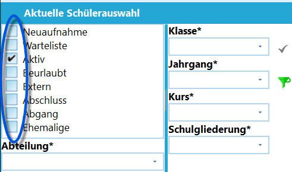
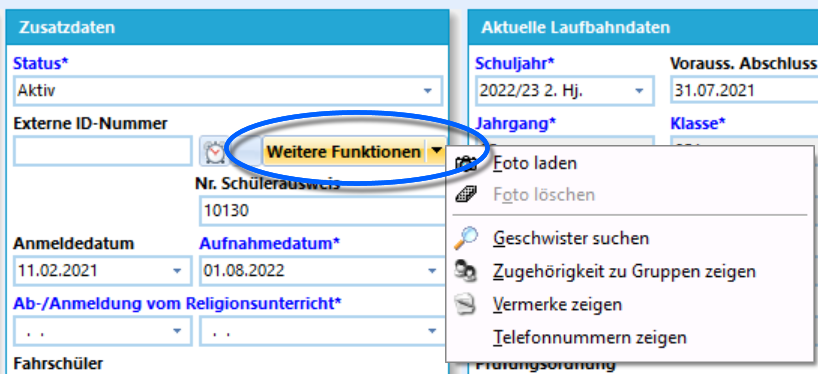

# Individualdaten I (Schüler) 

 Auf dem Karteireiter **Individualdaten I** wird
der erste Teil der auf die Person bezogenen Daten gespeichert.In der Regel werden die Daten zum Schüler oder der Schülerin
eingetragen. Für einige Daten, wie die Meldeadresse, sind offizielle
Dokumente vorzuzeigen.Im Kopf des Feldes werden Name, Klasse, die interne ID und wann und wer
die letzte Änderung am Datensatz durchführte angezeigt.

Die mit Grau unterlegten Felder im Bereich *Aktuelle Laufbahndaten* auf
der rechten Seite des Feldes bedeuten, dass diese hier in der Übersicht
lediglich nur gelesen werden können. Die Daten werden im Reiter
*Aktuelles Halbjahr* gesetzt.

Die statistisch relevanten Daten werden mit einem
Sternchen hinter der Feldbezeichnung gekennzeichnet. Diese Felder müssen
zur Erstellung der Statistik korrekt befüllt sein beziehungsweise die
korrekte Befüllung entlastet das jährliche Erstellen der Statistik. Hier
wurden die Felder über die *Verwaltung ➜ Einstellungen* blau
eingefärbt.

## Basisdaten

In diesem Bereich werden die grundsätzlichen Daten zur Person erfasst,
wie der *Name*, *Vorname* und das *Geburtsdatum*.Über die drei "**...**" neben dem Feld *Name* kann ein Namenszusatz
erfasst werden.

Die "**+**"-Schaltflächen neben dem *Ort* und dem *Ortsteil* öffnen den
Katalog, um neue Einträge vorzunehmen. Existierende Einträge der
Kataloge können über das Dropdown-Menü bei den Feldern ausgewählt
werden.Über "**...**" neben der Straße lassen sich zusätzliche Angaben der
Adresse vermerken.

## Zusatzdaten

Sehr wichtig bei den *Zusatzdaten* ist der **Status**: Dieses Feld
bestimmt, wie die Schule den Schüler verwaltet und in welchem
"Kartekasten" eine Person sich befindet. Wollen Sie den Schüler z.B. von
*Neuaufnahme* nach *Aktiv* bewegen, so stellen Sie dies an dieser
Position ein. Erlang ein Schüler einen *Abschluss*, erhält er diesen
Status.

 Wenn Sie einen Schüler oder eine Schülerin im Status
verändern wollen, so muss der Zielstatus vorher auch mit in der
enthalten Filterung sein. Wenn Sie z. B. einen Schüler oder eine
Schülerin von der *Warteliste* auf *Aktiv* setzen wollen, müssen sowohl
die Schülerinnen und Schüler der Warteliste als auch die aktiven
angezeigt sein.Tragen Sie hier die Haupt-Telefonnummern des Schülers oder der Schülerin
bei **Telefon** ein. Sie können dann auf dem Karteireiter
*Erz.-Berechtigte* unter "Telefon-Nummern" noch beliebig viele weitere
Nummern eintragen.Wenn Sie eine Telefonanlage haben, die die automatische Telefonwahl aus
Windows heraus unterstützt, dann können Sie diese Nummern mit der
rechten Maustaste anklicken und die Nummer direkt an Ihre Telefonanlage
leiten lassen.Wenn in den *Programm-Einstellungen* die automatische Übernahme der
Telefonnummern zu *Erz.-Berechtigte* aktiviert ist, fragt das Programm
nach, ob bei Änderungen auch die dortigen Nummern angepasst werden
sollen.Bei einer Neueingabe der Telefonnummer legt Schild-NRW bei aktivierter
Option die Nummern "Festnetz", "Faxnummer" oder "Mobilnummer" im Reiter
*Erz.-Berechtigte* an. Im Feld "Fax- / Mobilnummer" werden dann die
ersten beiden Zeichen ausgewertet. Sollte es sich um "01" handeln, so
wird die Nummernart "Mobilnummer" angelegt. Dies kann aber später
geändert werden.

Die Daten wie *Fahrschülerart* werden über Dropdownmenüs gesetzt, deren
Inhalte sich über die jeweiligen *Kataloge* steuern lassen. Ein
eventuelles "**+**" neben der Schaltfläche ruft den passenden Katalog
zur Bearbeitung auf.

## Weitere Funktionen

 Hier können über ein Menü einige Funktionen erreicht
werden:-   **Foto laden**
-   **Foto löschen**
-   **Geschwister suchen**, hierbei wird anhand des Nachnamens und der
    Adresse gesucht! Es lassen sich also nicht zuverlässig alle
    Geschwisterkinder in unterschiedlichen Familienkonstellationen über
    diese Schaltfläche filtern.
-   **Zugehörigkeit zu Gruppen zeigen**: Wurden Schüler zu
    *Individuellen Schülergruppen* oder *Personengruppen* hinzugefügt,
    lassen sich dieser hier anzeigen.
-   **Vermerke zeigen**: Zeigt alle gesetzten *Vermerke*. Vermerke
    werden ansonsten über den Reiter *Laufbahninfo* angesehen, gesetzt
    und verändert.
-   **Telefonnummern zeigen**: Zeigt ein Fenster Telefonnummern von
    *Erz.-Berechtigte*.

## Aktuelle Laufbahndaten

Hier werden die Laufbahndaten gezeigt, dies betrifft etwa *Klasse*,
*Jahrgang* oder die *Prüfungsordnung*. Diese sind im *aktuellen
Lernabschnitt* hinterlegt und werden üblicherweise über Gruppenprozesse
klassenweise gesetzt beziehungsweise automatisch bei einer Versetzung
basierend auf der *Klassen- und Versetzungstabelle* aktualisiert.

## Weitere Angaben

Einige dieser Felder wie die Prüfung auf *Volljährig* werden automatisch
gesetzt.Andere Felder werden abgefragt und von Hand befüllt. Dies betrifft etwa
den Nachweis des *Masernschutzes* oder ob die *Konfession auf Zeugnis*
gedruckt werden soll.Zu beachte ist hier das Feld *Keine Auskunft an Dritte*. Wurde dieser
Haken gesetzt, wird der Schülername im Container auch rot eingefärbt.Wurde ein Foto gesetzt, wird dieses unten Rechts angezeigt.