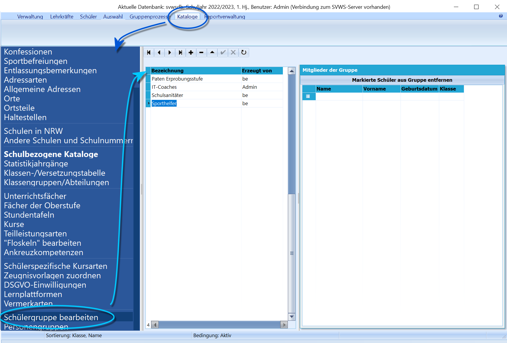
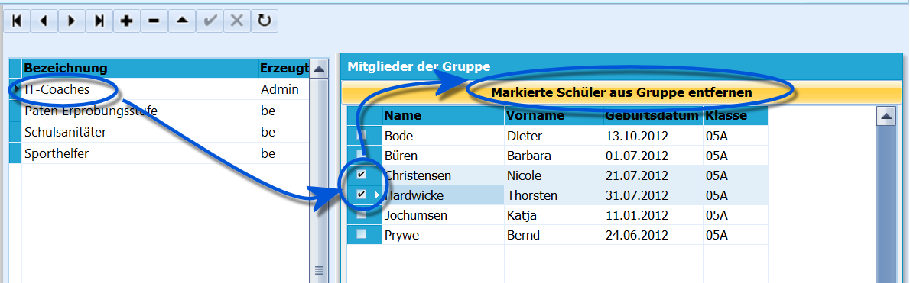
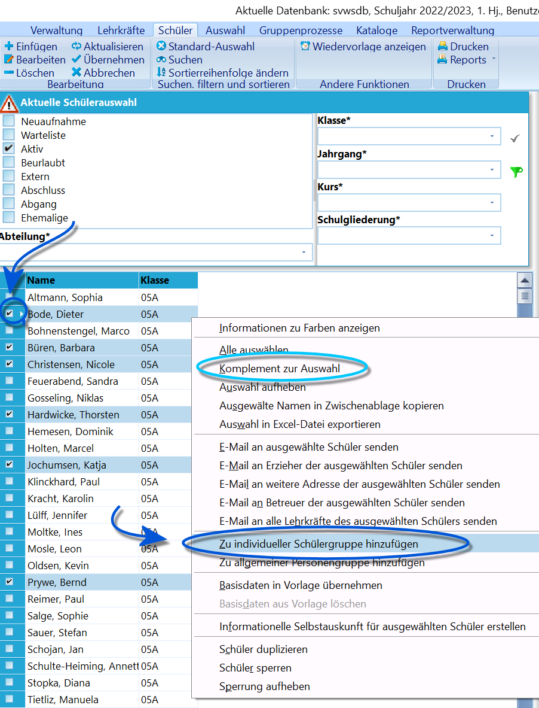
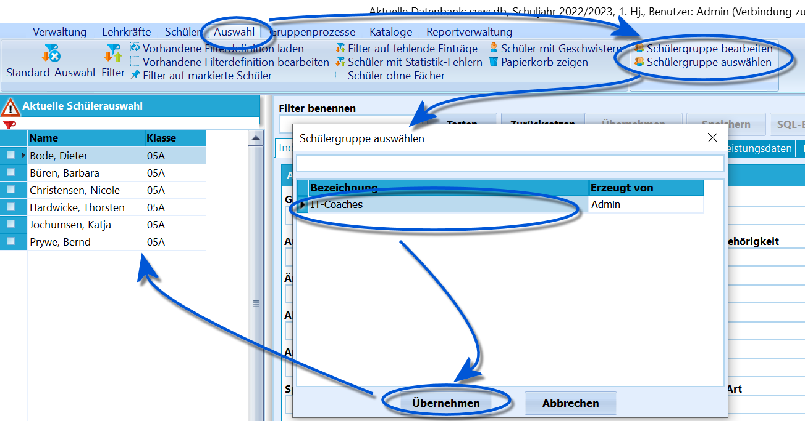

# Individuelle Schülergruppen bearbeiten und nutzen (Tutorial)Mit einer individuellen Schülergruppe können beliebige Gruppen definiert
werden und somit unabhängig von den Zuordnungen in den Leistungsdaten
(Klassen, Kurse, AGs, ZUV etc.) als Auswahl zur Verfügung stehen.

## Eine Individuelle Schülergruppe erstellen, bearbeiten und Schüler entfernen

Damit eine Individuelle Schülergruppe genutzt werden kann, muss diese
zuerst definiert werden.

 Gehen Sie über *Kataloge* zu **Schülergruppe bearbeiten**.In diesem Fenster können nun vorhandene Einträge bearbeitet werden. Wie
in SchILD üblich können über das **+** neue Einträge angelegt werden.Wurde eine Gruppe angewählt, sind auf der rechten Seite die Mitglieder
der Gruppe zu sehen. In der neuen Gruppe ist dieses Fenster natürlich
noch leer.  

 Um Schüler zu entfernen, wählen Sie die Gruppe an und
markieren Sie die betreffenden Einträge.Ein Klick auf **Markierte Schüler aus der Gruppe entfernen** führt die
Aktion aus.  

## Personen zu einer Schülergruppe hinzufügen

Wählen Sie die Personen aus, die Sie einer Gruppe hinzufügen möchten,
indem diese im Container mit einem Haken markiert werden.Ein Rechtsklick öffnet das Kontextmenü, in welchem **Zu individueller
Schülergruppe hinzufügen** ausgewählt werden kann.Es stehen hier alle Schülergruppen zur Auswahl, auf die der gewählte
Nutzer Zugriff hat. Zu dieser werden die Schüler nun hinzugefügt.  

## Eine Schülergruppe auswählen

 Über *Auswahl* ➜ **Schülergruppe auswählen** stehen nun
alle Gruppen zur Verfügung, auf die der aktuelle Nutzer Zugriff hat.Eine Wahl der Gruppe und ein Klick auf **Übernehmen** befüllt den
Container mit den Schülern der Gruppe.

Diese können nun über andere Prozesse weiterverarbeitet werden, z.B.
kann mit einem Report eine Liste dieser Schüler gedruckt werden.