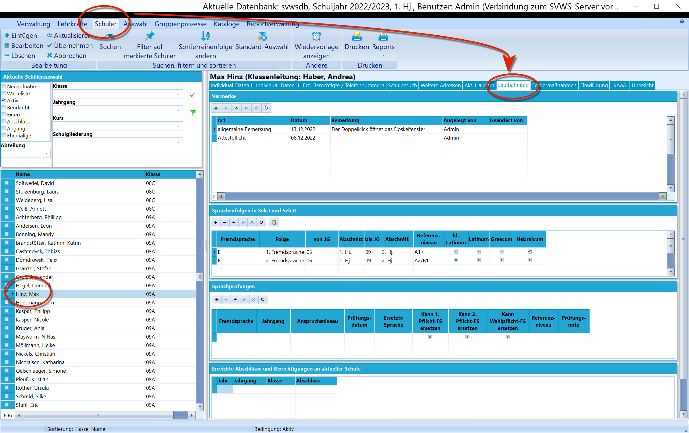
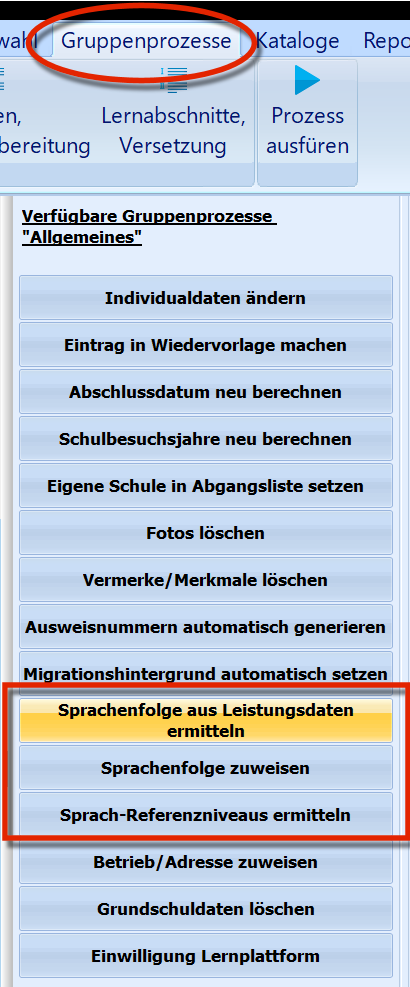
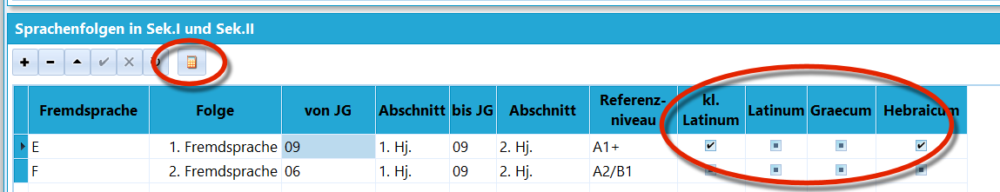

# Laufbahninfo (Schüler)

 Der Bereich der Laufbahninfo wird in die Bereiche
*Vermerke*, *Sprachenfolgen*, *Sprachprüfungen* und *Erreichte
Abschlüsse* eingeteilt.

## Sprachenfolgen

Die während der Laufbahn belegten Fremdsprachenabschnitte werden hier
erfasst. Es ist für jede Fremdsprache die *Fremdsprache* anzuwählen,
dann kommt durchnummeriert die *Folge* (1. FS, 2. FS usw.), es folgen
*von Jg.* mit dem passenden *Abschnitt* und *bis Jg.*, wieder mit dem
passenden *Abschnitt*.

 Das *Referenzniveau* lässt sich von Hand eintragen oder
automatisch per *Gruppenprozess* berechnen. Der Gruppenprozess liefert
natürlich nur sinnvolle Ergebnisse, wenn die Sprachenfolgen vorher
korrekt eingetragen waren.

 Über das kleine Rechnersymbol lässt sich das Sprachniveau
nach dem *europäischen Referenzrahmen* berechnen.Weiterhin lassen sich *manuell* (!) besondere Sprachqualifikationen
(Latinum, Graecum, Hebraicum) anwählen.

## Gruppenprozesse zu Sprachenfolgen

Bei den Gruppenprozessen kann SchILD die Sprachenfolge aus den ➜
*Leistungsdaten ermitteln*, also aus den belegten Fächern der vorherigen
Lernabschnitte.Es kann auch einer ausgewählten Schülermenge eine Sprachenfolge manuell
zugewiesen werden ➜ *Sprachenfolge zuweisen*.Schlussendlich kann für eine komplette Schülergruppe das ➜
*Sprach-Referenzniveau* aus den korrekt eingetragenen Sprachenfolgen
berechnet werden.  

## Sprachprüfungen

In dieser Spalte werden eventuell abgelegte Sprachprüfungen mit den
jeweils relevanten Daten erfasst.

## Erreichte Abschlüsse und Berechtigungen an aktueller Schule

Wurden während der Laufbahn schon Abschlüsse erreicht, werden diese hier
zeilenweise erfasst.