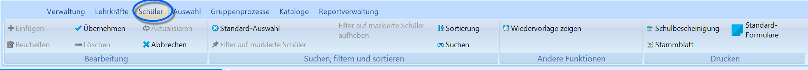
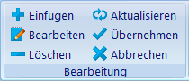

# Menüband (Schüler)

  
Im Reiter **Schüler** gibt es die Möglichkeit die Daten zu bearbeiten,
verschiedene Aktionen zu starten und die Daten zu filtern.Der erste Bereich im Menüband sind die Funktionen der Gruppe
*"Bearbeitung"*.An dieser Stelle ist es möglich neue Datensätze anzulegen
("**Einfügen**"), bestehende Daten zu **aktualisieren**, zu
**bearbeiten** oder auch zu **löschen**.  

 Bei der Bearbeitung von Daten ist es immer wichtig die
Änderungen mit dem Button "**Übernehmen**" zu bestätigen, um die
Einträge in die Datenbank zu übertragen.Sollen bestehende Einträge gelöscht werden, erscheinen mehrere
Warnhinweise, die noch bestätigt werden müssen.  Mit dem Button "**Abbrechen**" ist es möglich die Eingabe von Daten
abzubrechen.Der zweite Bereich im Menüband ist *"Suchen, filtern und sortieren"*.-   Die Funktion Suchen öffnet die Suchmaske mit deren Hilfe nach
    bestimmten SuS **gesucht** werden kann.
-   Bei einem Klick auf den Button "**Filter auf markierte Schüler**"
    werden die markierten SuS als gefilterte Menge ausgewählt. Für diese
    Gruppe können dann entsprechende Gruppenprozesse bzw. Änderungen an
    den gespeicherten Daten vorgenommen werden.
-   Mit "**Sortierreihenfolge ändern**" kann die Reihenfolge der
    angezeigten SuS an die gewünschte Reihenfolge angepasst werden.
-   Die Schaltfläche "**Standard-Auswahl**" stellt die als Standard
    gewählte Reihenfolge wieder her.Der Bereich "Andere" enthält die Funktion "**Wiedervorlage anzeigen**".
Damit wird die Maske zur Verwaltung der Wiedervorlagen aufgerufen.Der Bereich "Drucken" umfasst die beiden Funktionen "Drucken" und
"Reports" mit denen die gewünschten Dokumente zu einzelnen SuS bzw.
Listen für die gefilterte Menge an SuS gedruckt werden können.