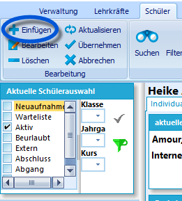
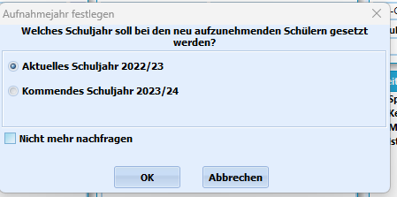
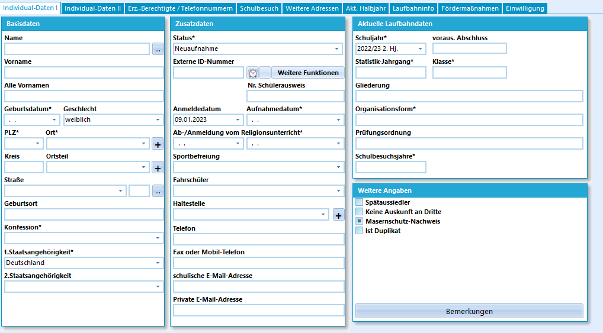
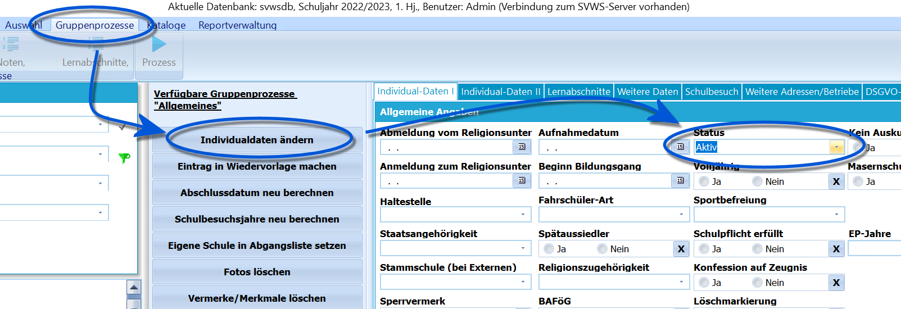

# Neuaufnahmen in Schild-NRW (Tutorial) 

 Als Voraussetzung für die Neuaufnahme und damit
für den Eintrag der Daten von Schülern, müssen alle grundlegenden
schulspezifischen Eintragungen in Schild-NRW erfolgt sein. Weitere
Informationen hierzu finden Sie im Menü Schulverwaltung und Kataloge.Klicken Sie in der Leiste unter den Menüpunkten auf das "+ Einfügen", um
einen neuen Schülerdatensatz anzulegen.  

 Bevor Sie die Daten des Schülers eingeben können, müssen
Sie entscheiden, welches Aufnahmejahr dem Schüler zugeordnet werden
soll.Wird ein Schüler im laufenden Schuljahr aufgenommen, ist das aktuelle
Schuljahr zu wählen.Sind Sie gerade in der Anmeldephase und geben die Daten aller neu
angemeldeten Schüler ein, wählen Sie hier einmal das kommende
Schuljahr.  

 In die leeren Registerkarten tragen Sie anschließend die
Daten des Schülers ein. Beachten Sie, dass alle Felder mit einem
Sternchen relevant für die Statistik-Haupterhebung sind.Zum Schuljahreswechsel soll der Status der Schüler, die sich im Februar
angemeldet haben, von Neuaufnahme in Aktiv geändert werden. Vor dem
Statuswechsel kann schon die Zuordnung zur neuen Klasse vorgenommen
werden und ein passendes Informationsschreiben könnte herausgeschickt
werden.  

 Um den Statuswechsel von *Neuaufnahme* nach *Aktiv*
durchzuführen, wählen Sie den Karteikasten Neuaufnahme aus, so dass alle
neu angelegten Schüler in der aktuellen Schülerauswahl enthalten sind.Nun führen Sie die Statusänderung durch, indem Sie den Menüpunkt
*Gruppenprozesse* wählen und dort unter *Allgemeines* die
*Individualdaten* ändern auswählen. Auf dieser Karteikarte geben Sie als
Status nun als *Aktiv* an und führen den Gruppenprozess aus.

Die Schüler sind nun dem Status *Aktiv* zugeordnet und werden
entsprechend in der Standardauswahl im Schülercontainer angezeigt.  
Die Schüler können nun per weiterem Gruppenprozess ihren
Einstiegsklassen zugeordnet werden.  
----

### Videotutorial
<youtube>C6N7sdEIJu0</youtube>
