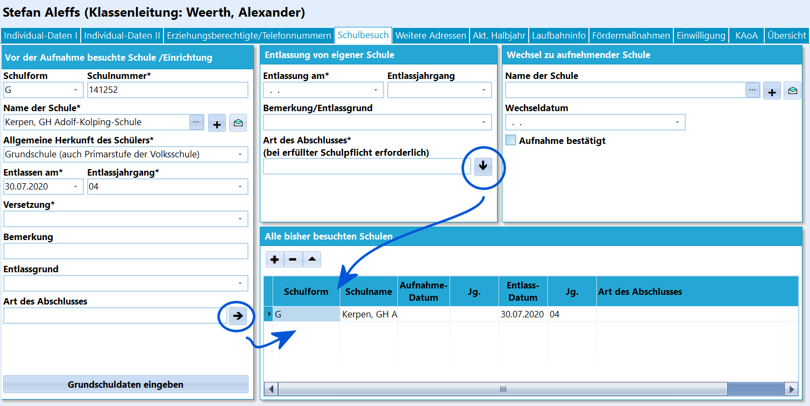
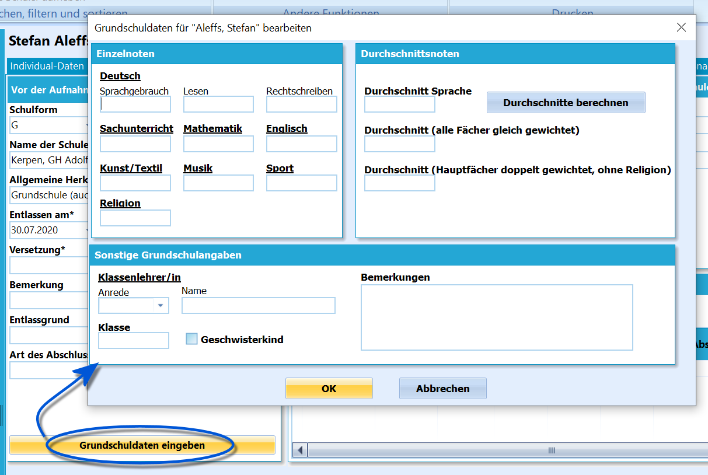
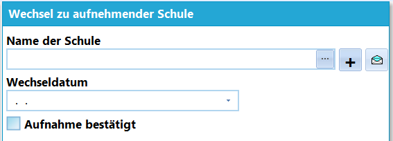
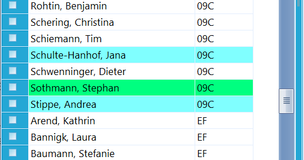

# Schulbesuch (Schüler) 

 Auf dem Karteireiter *Schulbesuch* werden alle
bisher besuchten Schulen aufgeführt.Insbesondere die Schule aus dem letzten Schuljahr und die Art des
Abschlusses werden hier vermerkt und in der Statistik abgefragt.Bei Berufskollegs wird auf diesem Reiter nach dem **höchsten
allgemeinbildenden Abschluss** gefragt, der von dem Schüler je erworben
wurde. Hat der Schüler im letzten Schuljahr ein Berufskolleg besucht,
dann wird hier auch die Eingabe der Fachklasse erwartet.  

## Herkunft des SchülersMit dem *schwarzen Pfeil* bei *Art des Abschlusses* werden die Daten der
Schule nach rechts in die Liste *aller bisher besuchten Schulen*
übernommen.Der Karteireiter **Schulbesuch** hat für die Erstellung der Statistik
einige entscheidende Eintragungsfelder.Der gesamte Bereich *Vor der Aufnahme besuchte
Schule/Einrichtung/Sonstige Herkunftsarten* wird bei allen Schülern der
Schule ausgewertet, die im letzten Schuljahr noch nicht an der eigenen
Schule waren. Das bedeutet bei allen Neuaufnahmen und den Schülern, die
zu Schuljahresbeginn "zugezogen" sind.

**Schulformspezifische Hinweise:**-   Eine Ausnahme bilden die **Grundschulen**: bei allen "Erstklässlern"
    bleibt dieser Bereich natürlich leer. Lediglich die **Herkunftsart**
    *Einschulung* wird eingetragen. Stattdessen werden die Eintragungen
    zum Grundschulbesuch auf dem Karteireiter *Individualdaten II*
    ausgewertet.<!-- -->-   Für **Sekundarschulen** gilt das *Schulformkürzel* ist *SK* und die
    *allgemeine Herkunft* ist *SE*. Das Herkunftskürzel *SK* ist bei der
    *allgemeinen Herkunft* durch den *Schulkindergarten* besetzt.<!-- -->-   An **Berufskollegs** und **Weiterbildungskollegs** gibt es Schüler,
    die im vergangenen Schuljahr keine Schule besucht haben. Hier gelten
    die besonderen
    **

DEADLINK: Eintragungsmodalitäten - Eintragung_Herkunft_am_BK/WBK_(Tutorial).md

**!

Um die Eintragungen für die Statistik näher zu erklären, dient die

folgende Tabelle. Hier werden die Felder in Schild-NRW und die
Bezeichnungen von IT.NRW gegenübergestellt.
| SchILD-NRW Name des Feldes | IT.NRW-Statistik (Statkue.mdb) | Anzeigefilter in SchILD-NRW |
| --- | --- | --- |
| Allg. Herkunft des Schülers | Herkunftsschulform | Es wird auf die Schulform der Herkunftsschule gefiltert. |
| Versetzung | Herkunftsart | Filter auf zulässige Einträge der eigenen Schulform |
| Höchster allgemeinbildender Abschluss (BK,WBK) Art des Abschlusses (andere Schulen) von abgebender Schule | Abgangsart | Filter auf Schulform und Jahrgang der abgebenden Schule. (Hier haben die BKs und WBKs eine feste programminterne Tabelle in SchILD-NRW wegen der Dopplungen in der Statkue.mdb) |
| Art des Abschlusses von eigener Schule | Abgangsart | Filter auf eigene Schulform und Jahrgang |
Bezeichnungen SchILD-NRW gegenüber IT.NRW

## Grundschuldaten eingeben

 Auf dem Karteireiter *Schulbesuch* ist es an
weiterführenden Schulen möglich, Daten der Grundschule für den Übergang
an die Schule einzugeben.Bitte klicken Sie dazu auf den Button **

WIKILINK: Grundschuldaten_eingeben_(Schüler_Schulbesuch)**.  

## Entlassung von eigener Schule

Tragen Sie hier die Daten bei der Entlassung von der eigenen Schule ein.
Dies betrifft *Abschluss* wie *Abgänger*.Es empfiehlt sich, diese Eintragungen vor der Versetzung im
Abschlussjahrgang zu tätigen. Allerdings können die Daten auch später
noch nachgetragen werden, wenn die Schülerdatensätze schon im Abgänger-
oder Abschlusskasten sind.

## Wechsel zu aufnehmender Schule

 

 Die Angaben können Sie nutzen, um einen
besseren Überblick zur Schulpflichtüberwachung zu haben.Es werden Schüler eingetragen, die abgehen und zu einer anderen Schule
wechseln, aber auch Schüler, die an der aktuellen Schule ihren
Bildungsweg, auch mit Abschluss, beendet haben.An *Grundschulen* und an *weiterführenden Schulen* in der Klasse 9
beziehungsweise der Klasse 10, bei denen einen Sekundarstufe-II-Schule
eingetragen wurde, hat diese Eintragung noch einen weiteren Effekt:Alle Schüler, bei denen eine aufnehmende Schule - beziehungsweise eine
Schule der Sekundarstufe II - eingetragen ist, werden im mit einer
*türkisen* Hintergrundfarbe dargestellt. Diese Hintergrundfarbe ändert
sich dann nochmals auf *grün*, wenn der Haken bei "Aufnahme bestätigt"
gesetzt wurde.

Dies soll eine optische Hilfe zur Kontrolle aller Schulanmeldungen
sein.  

## Alle bisher besuchten Schulen

Zu Informationszwecken können hier alle bisher besuchten Schulen
aufgelistet werden.

Die Eintragung von Links (Grundschulbesuch, andere vorherige Schulen) im
oberen Bereich (Entlassung von eigener Schule) kann hierher mit dem
"schwarzen Pfeil" übernommen werden.Zusätzliche Eintragungen können über das Plussymbol **+** ergänzt
werden.