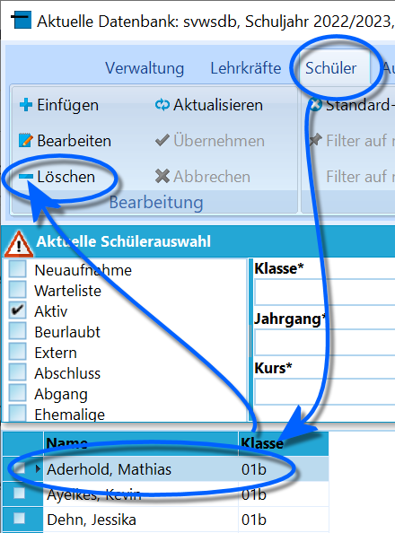
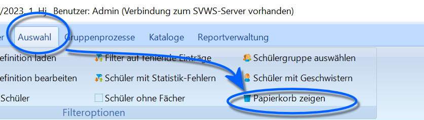
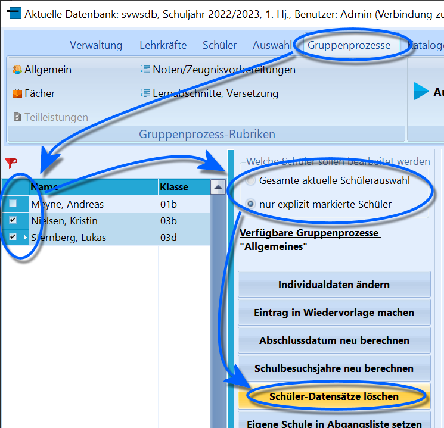
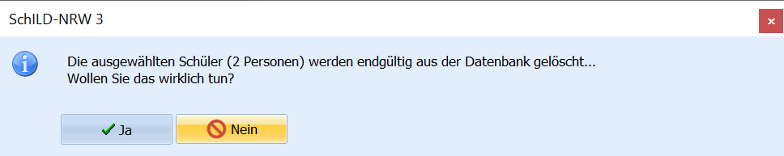
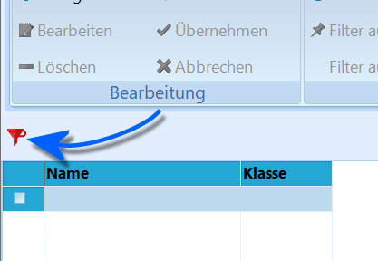
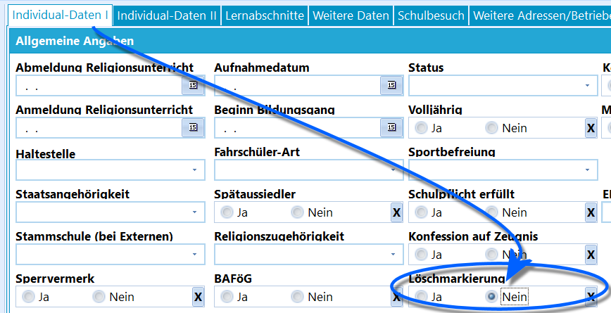
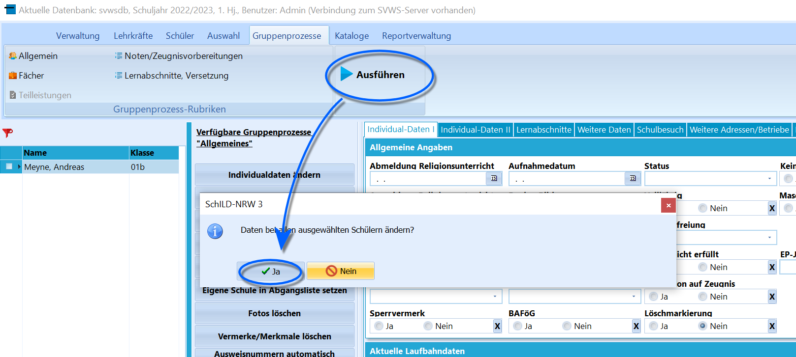

# Schüler löschen und wiederherstellen (Tutorial)

## Schüler löschen

 Schüler lassen sich in der *Schüler*-Übersicht mit dem
"**-**" aus dem Container entfernen.Damit sind diese aber noch nicht aus der Datenbank entfernt, sondern
werden lediglich mit einem *Löschvermerk* versehen und durch diesen
nicht mehr aufgeführt.Stattdessen wird der Schüler nur noch unter *Auswahl* ➜ **Papierkorb
zeigen** angezeigt.  
==Schüler wirklich löschen== 

 Um eine tatsächliche Löschung
aus der Datenbank vorzunehmen, sind erst alle Schüler mit Löschvermerk
über *Auswahl* ➜ **Papierkorb zeigen** anzuwählen.  

 Wechseln Sie auf den Reiter *Gruppenprozesse*.Hier wählen Sie die Schüler aus, die tatsächlich gelöscht werden
sollen - oder wenden Sie den Gruppenprozess auf die komplette Gruppe an.Klicken Sie dann auf `Schüler-Datensätze löschen`.  

 Bestätigen Sie den Löschvorgang mit `Ja`.

Die Löschaktion wird durchgeführt und die Schüler sind dauerhaft aus der
Datenbank entfernt.  

 Der Schülercontainer filtert aber noch immer auf den
Papierkorb.Klicken Sie auf das rote Filtersymbol, um die Standardeinstellung des
Filters im Schülercontainer wiederherzustellen.  

## Schüler wiederherstellen

 Sind Schüler noch im Papierkorb und nicht tatsächlich aus
der Datenbank gelöscht, können diese wiederhergestellt werden, so dass
sie wieder in der normalen Ansicht verfügbar sind.Hierzu muss die *Löschmarkierung* wieder entfernt werden. Diese ist in
den *Individualdaten* gespeichert, wird in den Masken *Individualdaten
I* oder *Individualdaten II* nicht angezeigt.Es wird hier ein Gruppenprozess verwendet, um diese Löschmarkierung zu
entfernen. Dies betrifft auch den Fall, dass nur einzelne Schüler
wiederhergestellt werden sollen.Gehen Sie wie beim *Löschen aus der Datenbank* oben in *Auswahl* ➜
**Papierkorb zeigen**.Wählen Sie den oder die wiederherzustellenden Schüler aus.Gehen Sie nun über *Gruppenprozesse* ➜ **Individualdaten ändern** und
setzen Sie unter *Allgemeine Angaben* die **Löschmarkierung** auf
*Nein*.  

 Klicken Sie auf `Ausführen` und dann bestätigen Sie mit
`Ja` oder brechen Sie noch mit `Nein` ab.Der Schüler ist nun wiederhergestellt.  

 Der Schülercontainer filtert aber noch immer auf den
Papierkorb.Klicken Sie auf das rote Filtersymbol, um die Standardeinstellung des
Filters im Schülercontainer wiederherzustellen.