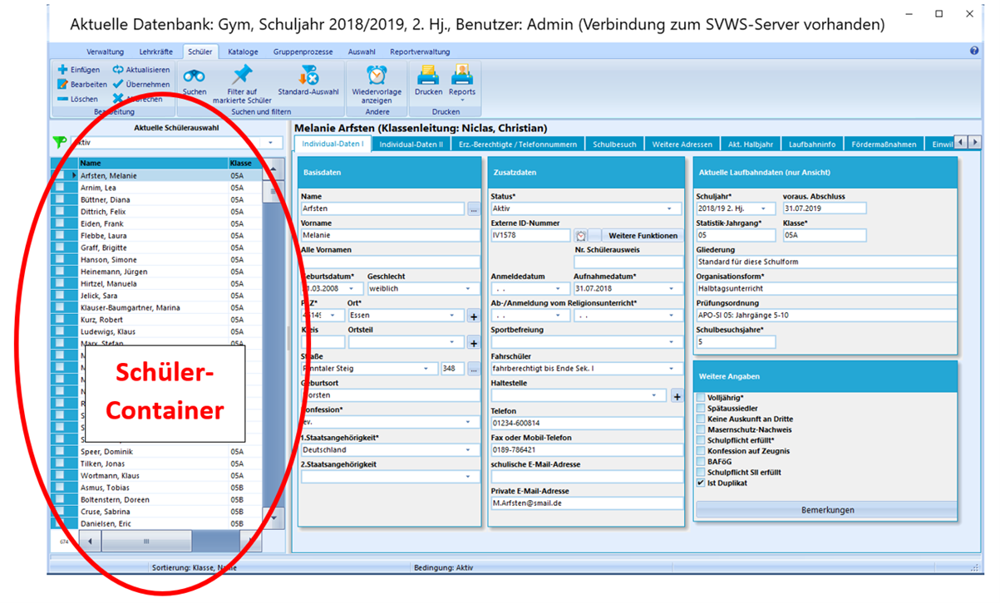
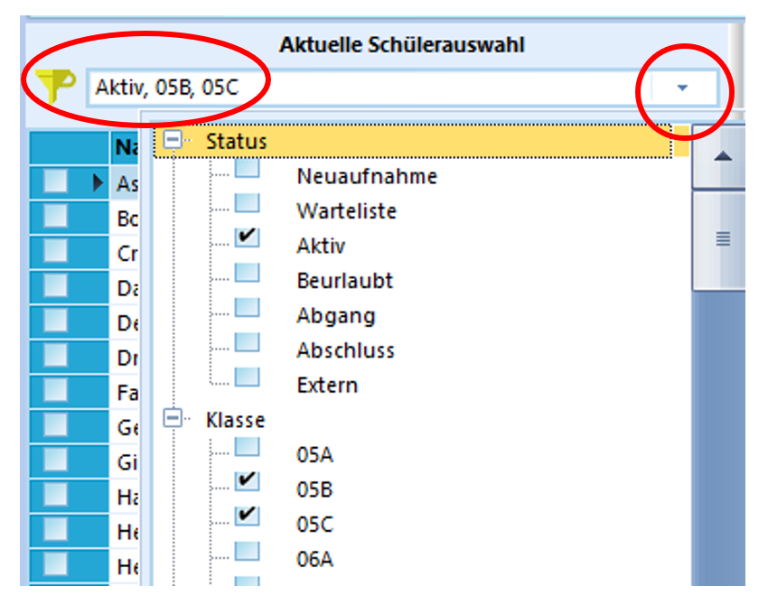
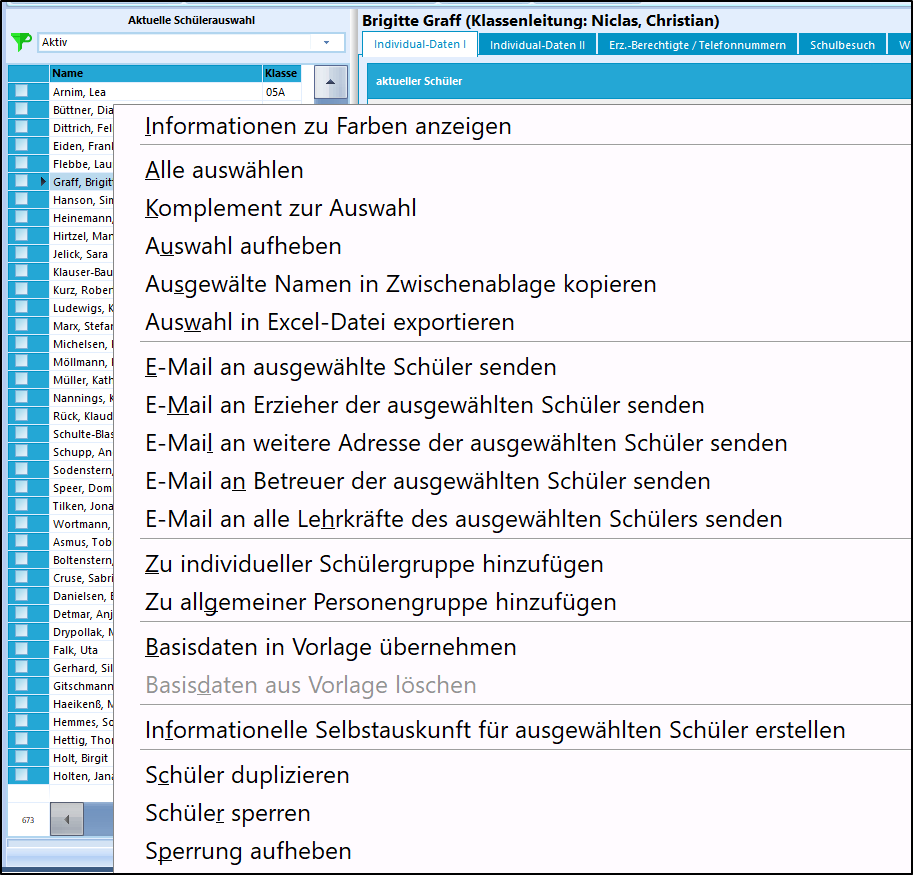
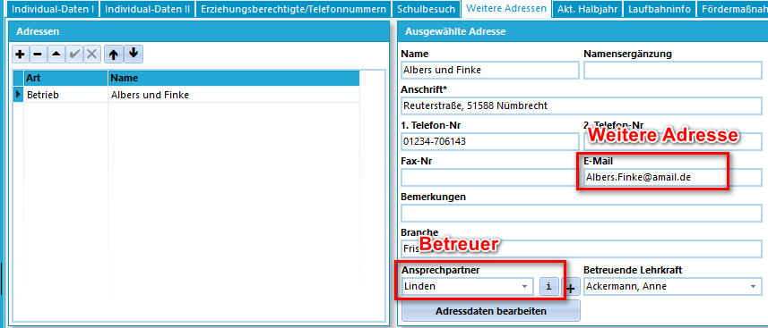

# Schülercontainer (Schüler) 

 Auf der linken Seite des Hauptfensters befindet
sich der Schüler-Container. Hier wird die aktuell ausgewählte
Schülergruppe gezeigt.Beim Programmstart werden zunächst alle aktiven Schüler der Schule
aufgelistet. Diese sogenannte Standard-Auswahl wird durch ein grünes
Filtersymbol signalisiert.Durch Anklicken eines einzelnen Datensatzes werden die zugehörigen Daten
auf den Karteireitern gezeigt.

Die Anzahl der zur Zeit gefilterten Datensätze wird unten links in der
Ecke angezeigt.  

 Oberhalb des Containers befindet sich ein Auswahlfeld, um
schnell und unkompliziert bestimmte Schülermengen auszuwählen. Durch
Mausklick auf das Dreieck öffnet sich das Auswahlmenu.Hier kann Status, Klasse, Kurs, Jahrgang und/oder Abteilung der Schüler
aktiviert werden.Beim Berufskolleg kann zusätzlich die Fachklasse und die Gliederung
gefiltert werden.Mit der Einstellung wie im Bild rechts werden alle aktiven Schüler:Innen
aus der Klasse 5b und 5c im Schülercontainer angezeigt. Für diese Gruppe
kann nun beispielsweise ein Elternbrief gedruckt werden. Weiter kann nun
genau für diese Schüler:Innen ein Gruppenprozess ausgeführt werden.
Beispielsweise könnte man nun dieser Schülergruppe das Fach Informatik
mit nur wenigen Klicks hinzufügen.

Das gelbe Filtersymbol verdeutlicht, dass aktuell ein Schnellfilter
aktiviert ist. Die entsprechende Einstellung kann dort abgelesen werden.Um zur Standard-Auswahl zurückzukehren kann der Button
"Standard-Auswahl" aus dem Menuband ausgewählt werden. Alternativ erhält
man die Standard-Auswahl durch einen Doppelklick auf das gelbe
Filtersymbol.  

 Neben der Funktion, die Menge der Schüler zur
Weiterverarbeitung und zum Druck zu steuern, können im Container noch
einige andere Funktionen ausgeführt werden.

Diese zeigen sich bei einem Klick mit der rechten Maustaste in den
Containerbereich. (siehe Bild)Informationen zu Farben anzeigen  
Manchmal werden Schülernamen in einer anderen Farbe dargestellt. Durch
Auswahl von "Informationen zu Farben anzeigen" erscheint eine Legende zu
den verschiedenen Farben.Alle Auswählen  
Bei allen Schülern im Schülercontainer wird das Markierungshäkchen
gesetzt. Im Anschluss kann man bei einzelnen Schülern den Haken wieder
entfernen und durch Auswahl auf "Filter auf markierte Schüler" nur die
Schüler im Container laden, bei denen das Häkchen gesetzt ist. Die
Markierung bleibt bis zur Deaktivierung erhalten und kann für die
nächste Sitzung gespeichert werden. Bei Schließen von SchILD öffnet sich
ein Abfragefenster, sofern Schüler zum Zeitpunkt des Schließens markiert
sind.Komplement zur Auswahl  
Bei allen Schülern aus dem Schülercontainer wird das Markierungshäkchen
geändert.Auswahl aufheben  
Alle Markierungshäkchen werden aufgehoben.Ausgewählte Namen in Zwischenablage kopieren  
Ausgewählte Namen werden im Zwischenspeicher kopiert und können
beispielsweise mittels "einfügen" in ein anderes Dokument kopiert
werden.Auswahl in Excel-Datei  
Es öffnet sich ein Vorschau-Fenster. Durch Bestätigen über den
"Speichern"-Button werden die Spalten in einer Excel-Datei
gespeichert.  
**Hinweis**: In den individuellen Einstellungen kann man noch weitere
Spalten wie beispielsweise das Geburtsdatum oder die Telefonnummer dem
Schülercontainer hinzufügen. Dazu muss unter Verwaltung ➜ globalen
Einstellungen die Option "Individuelle Gestaltung der Schüler-
Übersichtstabelle ermöglichen" aktiviert sein.E-Mail an ausgewählte Schüler senden  
Je nach Einstellung, ob Mails über das Standard-Mailprogramm oder über
den SMTP-Server geschickt werden sollen, öffnet sich das
Standard-Mailprogramm oder eine Fenster zum Versenden der E-Mail. Unter
Verwaltung ➜ Einstellungen kann angegeben werden, ob die private oder
schulische Mailadresse bevorzugt werden soll.E-Mail an Erzieher des ausgewählten Schülers senden  
Alle Erziehungsberechtigten, bei denen die Option "erhält Anschreiben"
aktiviert ist, erhalten eine Mail. Analog zur Schülermail öffnet sich
vorab das Standard-Mailprogramm oder ein Vorschau-Fenster.

E-Mail weitere Adressen der ausgewählten Schülers senden  
Mit dieser Option kann eine Mail an einen Betrieb senden, der unter
weiteren Adressen bei einem Schüler eingetragen ist.E-Mail an Betreuer der ausgewählten SchülerInnen senden  
Zum Versenden einer Mail an den Ansprechpartner des Schülers, sofern
dieser bei den weiteren Adressen hinterlegt ist. Über den Button "**i**"
(= Information; siehe Abbildung) kann man die Mailadresse des Betreuers
einsehen.E-Mail an alle Lehrkräfte des ausgewählten Schülers senden  
Zum Versenden einer Mail an alle Lehrkräfte, die im aktuellen Halbjahr
bei den Fächern der Schüler hinterlegt sind. Unter Verwaltung ➜
Einstellungen kann angegeben werden, ob die private oder schulische
Mailadresse bevorzugt werden soll.Zu individueller Schülergruppe hinzufügen  
Mit dieser Option können SchülerInnen einer individuellen Schülergruppe
hinzugefügt werden. Es öffnet sich ein Fenster, in dem die
Schülergruppe, in der die jeweiligen Schüler hinzugefügt werden sollen,
ausgewählt werden kann. Durch das Markierungshäkchen können auch mehrere
Schüler gleichzeitig einer Schülergruppe hinzugefügt werden.Zu allgemeiner Personengruppe hinzufügen  
Mit dieser Option können ein oder mehrere SchülerInnen einer allgemeinen
Personengruppe hinzugefügt werden. Es öffnet sich ein Fenster, um die
entsprechende Personengruppe auszuwählen.Basisdaten in Vorlage übernehmen  
Diese Funktion bewirkt, dass beim aktuell ausgewählten Schüler einige
Basisdaten (Wohnort, Aufnahmedatum, ...) in eine Vorlage kopiert werden.
Sollte danach ein Schülerdatensatz durch "**+**" hinzugefügt werden, so
werden diese Basisdaten bei dem neu erzeugten Schüler-Datensatz bereits
vorausgefüllt.Basisdaten aus Vorlage löschen  
Löscht die Vorgaben aus der vorangegangenen Funktion.Informationelle Selbstauskunft für Schüler erstellen  
Mit Hilfe dieser Option kann eine CSV-Datei erstellt werden, in der
sämtliche Informationen des ausgewählten Schülers enthalten sind.Schüler duplizieren  
Nach Auswahl dieser Option, öffnet sich ein Fenster, in dem man angeben
kann, ob der neu angelegte Schüler als Duplikat markiert werden soll.
Durch Auswahl von "Ja" wird der Schüler dupliziert mit dem Status
"Neuaufnahme". Das Häkchen "Ist Duplikat" unter Individualdaten I ist
automatisch gesetzt. Zudem ist der Schüler im Container gelb hinterlegt.
Eine Klasse wurde noch nicht zugeteilt. Durch die Auswahl von "nein" im
Abfragefenster, wird der neu angelegte Schüler nicht als Duplikat
hinzugefügt.Schüler sperren  
Durch diese Option können Schüler gesperrt werden. Die Bearbeitung ist
für diese Schüler nicht möglich.Sperrung aufheben  
Mit dieser Option kann die Sperrung aufgehoben werden.  
----

### Videotutorial
<youtube>Scrgk2y0w9s</youtube>
