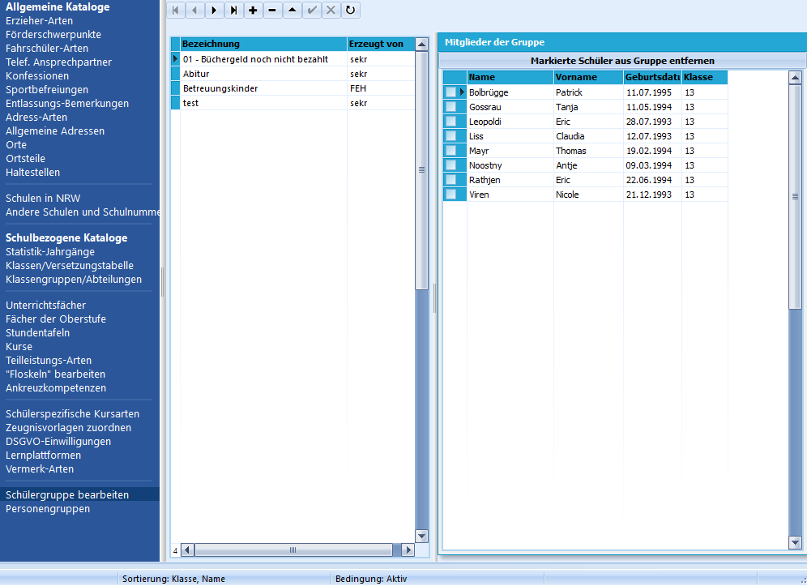

# Schülergruppe bearbeiten (Schulbezogene Kataloge)

Durch **Schülergruppen** können beliebige Schülerinnen und Schülern
zusammengefasst werden mit dem Ziel, sich diese Gruppe an Schülerinnen
und Schülern in der Zukunft schnell wieder von SchILD anzeigen zu
lassen.

Die Gruppenzusammensetzung kann dabei **individuell** festgelegt werden,
ebenso die Bezeichnungen dieser Gruppen.Nach Festlegung der verwendeten Schülergruppen in diesem Programmfenster
können einzelne oder auch mehrere Schülerinnen und Schüler diesen
Gruppen **zugewiesen** werden. Dies ist über Auswahl  

## Anlegen neuer Schülergruppen

 Durch Klick auf das "+" kann eine neue Schülergruppe
**angelegt** werden. In der Spalte "Bezeichnung" wird die entsprechende
Bezeichnung eingetragen. Die Einträge werden alphabetisch sortiert. In
der Spalte "Erzeugt von" wird der aktuell in SchILD angemeldete
Benutzername eingetragen.  

## Bearbeiten von Schülergruppen

Es können nur diejenigen Schülergruppen bearbeitet
werden, die vom aktuell angemeldeten Benutzernamen selbst angelegt
worden sind. Dies betrifft ebenfalls das Löschen einer Schülergruppe.

Durch einen Doppelklick in das entsprechende Feld in der Spalte

"Bezeichnung" kann die Bezeichnung bereits angelegter Schülergruppen
**geändert** werden.Ein Klick auf das "-" **löscht** die angelegte Schülergruppe nach
Bestätigung einer Dialogabfrage.Im Fenster "Mitglieder der Gruppe" können durch einen Klick auf
"Markierte Schüler aus der Gruppe entfernen" diejeningen Schülerinnen
und Schüler **aus der Gruppe gelöscht** werden, vor deren Namen ein
Häkchen gesetzt wurde.