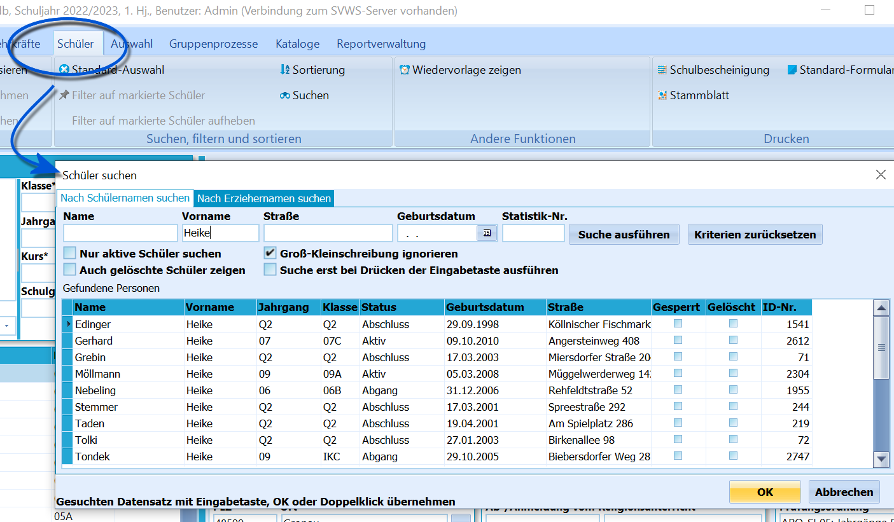

# Schülersuche (Schüler)

 

## Schülersuche

Indem Sie in *Schüler* auf **Suchen** klicken, öffnet sich ein Fenster,
über das sich Schüler sehr schnell finden lassen.Geben Sie Kriterien wie *Name*, *Vorname*, die *Straße* oder das
*Geburtsdatum* ein, um sofort alle Schüler angezeigt zu bekommen, auf
die alle eingegebenen Kriterien zutreffen.Haben Sie eine *Prüfung auf Statistikfehler* durchgeführt, lassen sich
gefundene Schüler mit Fehlern gut über die Eingabe der im Fehlerprotoll
aufgeführten *Statistik-Nr.* finden.Über Haken unterhalb des Suchfeldes lässt sich die Suche weiter
eingrenzen.-   **Nur aktive Schüler suchen** grenzt die Suche auf die nur aktiven
    Schüler ein. Per Standard werden alle Schüler in der Datenbank
    angezeigt.
-   **Groß- und Kleinschreibung** wird in der Standardeinstellung
    ignoriert.
-   **Auch gelöschte Schüler zeigen** blendet Schüler mit einem
    Löschvermerk wieder ein. Somit ließe sich der Löschvermerk auf
    wieder entfernen.
-   **Suche erst beim Drücken der Eingabe ausführen** sorgt dafür, dass
    nicht nach jedem eingegebenen Zeichen die Suche sofort ausgeführt
    wird.Ein **Doppelklick** auf einen Schülereintrag im Suchfenster springt
sofort auf den betreffenden Schüler im Schülercontainer, so dass nun mit
diesem weitergearbeitet werden kann.In der Kopfzeile des Suchfensters kann auf den Reiter *Nach
Erziehernamen suchen* umgeschaltet werden. Somit lassen sich unter *Erz.
Berechtigte* eingetragene Personen auffinden.

### Videotutorial
<youtube>vF1j_7-74hM</youtube>
