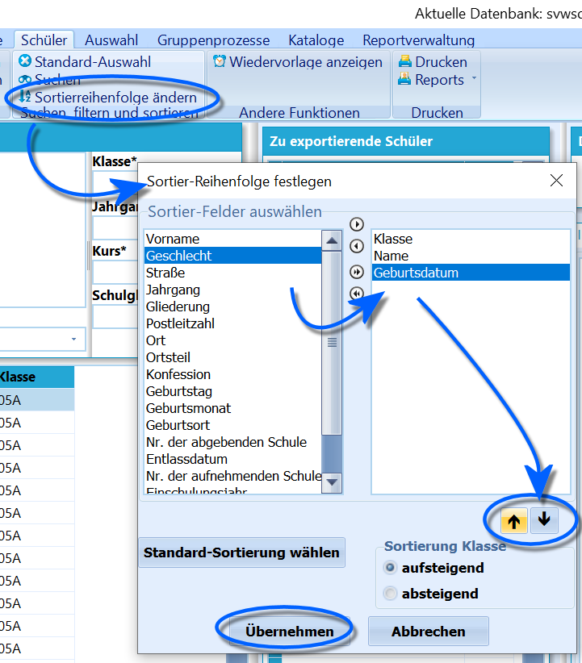

# Sortierung des Schülercontainers ändern (Tutorial) 

 Standardmäßig werden die Schüler im
Schülercontainer erst nach ihrer *Klasse* und dann nach ihrem
*Nachnamen* sortiert.Möchten Sie dieses ändern, kann eine benutzerdefinierte
Sortierreihenfolge festgelegt werden, die auch nach anderen Kategorien
sortiert.Wählen Sie **Schüler Sortierreihenfolge ändern**. Die als Kategorien
gewünschten Felder können per Doppelklick oder über die kleinen
schwarzen Pfeile zwischen den Fenstern als relevant in den rechten
Bereich verschoben werden.Innerhalb dieses Bereichs kann die Reihenfolge über die Pfeile unten
rechts verändert werden.Dann ist noch zu wählen, ob die Sortierung *"aufsteigend"* oder
*"absteigend"* sein soll.Wählen Sie nun **Übernehmen**.    
----

### Videotutorial
<youtube>kR7eZ8JbEIM</youtube>
