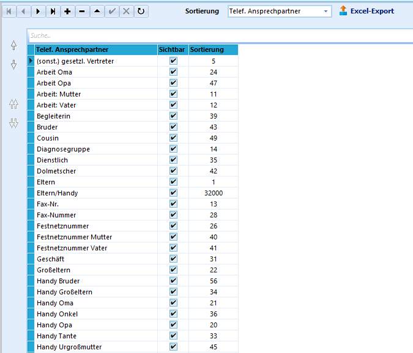
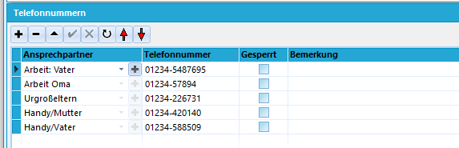

# Telef. Ansprechpartner (Allgemeine Kataloge)

Den Katalog der telefonischen Ansprechpartner füllen Sie mit den
Kontakten, die Sie im Zusammenhang mit der Betreuung einer Schülern oder
eines Schülers benötigen.Hier stellen sie alle weiteren Telefonkontakte bereit, die Sie verwenden
bzw. eintragen wollen.In der Regel finden sich hier Einträge wie Vater, Mutter, Großeltern,
Wohngruppe etc.  

 Auf dem Karteireiter *Schüler ➜ Erziehungsberechtigte*
können nun weitere Telefonnummern mit den Ansprechpartnern aus dem
Katalog eingetragen werden.