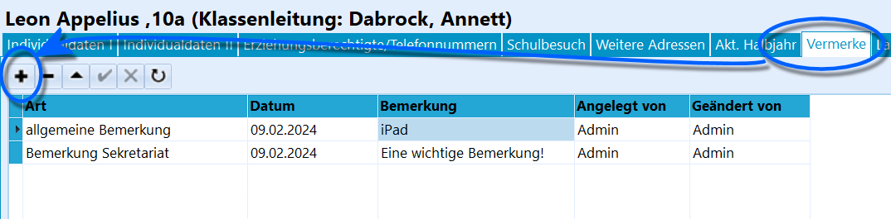
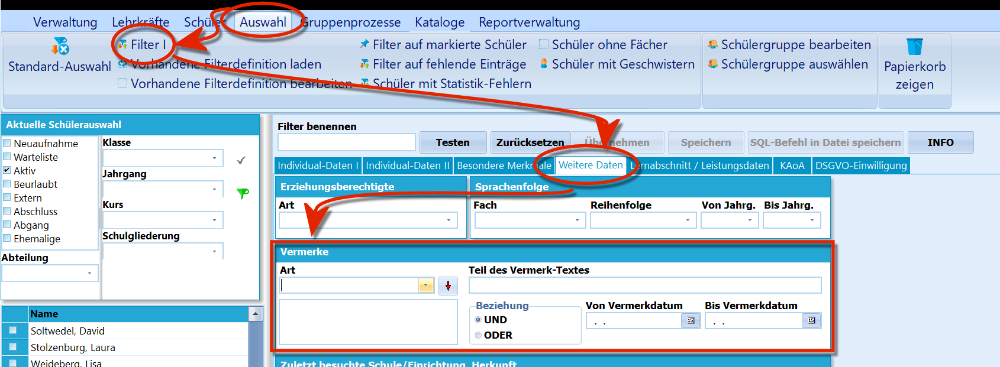

# Vermerke (Schüler)

 Zu jeder Person im Schülercontainer können über *Schüler ➜
Vermerke* angelegt werden.Jeder Vermerk besteht aus einer *Vermerkart*, einem *Datum* der Anlage,
einer optionalen *Bemerkung* und wer den Vermerk *angelegt* und dann wer
ihn zuletzt *geändert* hat.Lange Bemerkungen werden komplett angezeigt, wenn die Zeilenhöhe
vergrößert wird. Dazu den Mauscursor in der ganz linken Spalte zwischen
die Zeilen bewegen bis sich der Cursor in einen vertikalen Doppelpfeil
ändert. Nun kann die Zeile größer gezogen werden.

Die Vermerkarten können über *Kataloge* ➜ *Vermerkarten* wie bei
Katalogen üblich verwaltet werden.  

 Mit *Auswahl* ➜ *Schülerfilter* können auf der Karte
Weitere Daten im Bereich Vermerke nach *"Art"* und *"Teil des
Vermerk-Textes"* Eingaben gesucht werden, bei *"Vermerkdatum von...bis"*
kann ein Zeitbereich gewählt werden.  
Ein `Doppelklick` auf das Feld *Bemerkung* öffnet den Editor für
Floskeln, so dass zuvor festgelegte Floskeln für Vermerke direkt
verwendet werden können.

 Falls Sie an Ihrer Schule Vermerke nicht verwenden möchten,
kann der Reiter über *Verwaltung ➜ Einstellungen ➜ Globale Einstellungen
➜ Allgemeines ➜ Ansicht* über den Haken bei **Karteireiter "Vermerke"
zeigen** ausgeblendet werden.