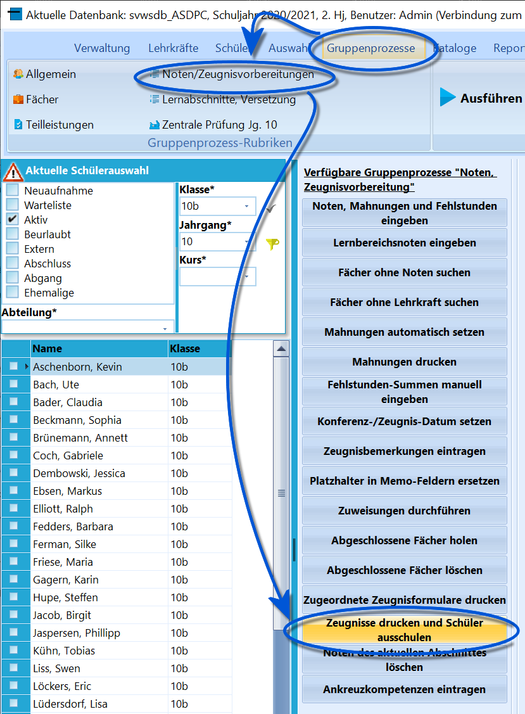
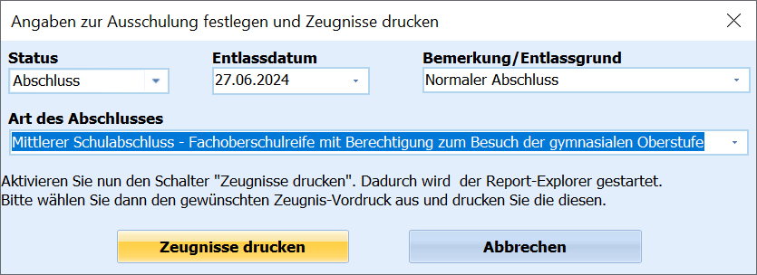
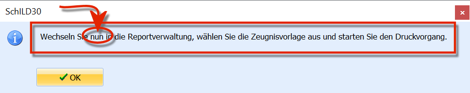
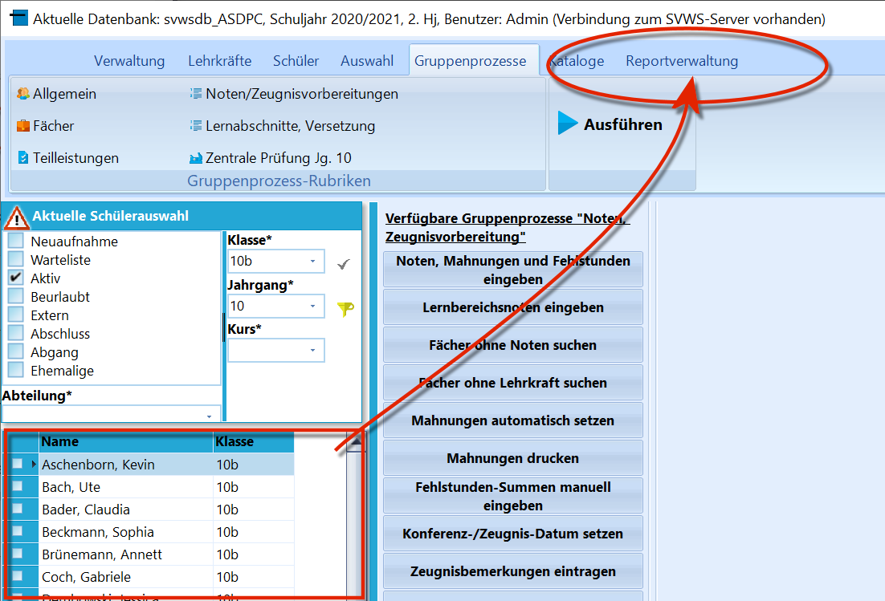

# Zeugnisse drucken und Schüler ausschulen (Gruppenprozesse Noten, Zeugnisvorbereitung)

Über *Gruppenprozesse ➜ Noten/Zeugnisvorbereitung ➜ Zeugnisse drucken
und Schüler ausschulen* kann in SchILD-NRW 3 für Abschlussjahrgänge,
Abgänger und Schulwechsler das Ausschulen und der Zeugnisdruck für eine
Schülergruppe mit identischem Zeugnisformular effizient durchgeführt
werden.

Die beiden Schritte – Ausschulen und Zeugnisdruck – können alternativ
auch getrennt über andere Gruppenprozesse und den einzelnen Reportdruck
erfolgen.Wählen Sie zunächst eine Schülergruppe aus, die das gleiche
Zeugnisformular erhalten soll, zum Beispiel alle Schülerinnen und
Schüler mit dem gleichen Abschluss. In vielen Fällen ist hierfür der
*Schülerfilter* erforderlich, da unterschiedliche Abschlüsse oder auch
*kein Abschluss* vorkommen können.Starten Sie anschließend den Gruppenprozess mit einem Klick auf
`Zeugnisse drucken und Schüler ausschulen`.

Geben Sie im folgenden Dialog die zur Gruppe passenden Daten ein. Der
Gruppenprozess erlaubt es, einzelne Felder leer zu lassen.

Dies kann eine Fehlerquelle darstellen, ist aber bewusst so vorgesehen,
damit bereits geprüfte Einträge nicht überschrieben werden und
bestehende Werte erhalten bleiben.Nach der Eingabe klicken Sie auf `Zeugnisse drucken`.Ein Klick auf `Abbrechen` beendet den Vorgang, ohne Änderungen in der
Datenbank vorzunehmen.

Bestätigen Sie die folgende Meldung mit `OK`.

Führen Sie nun in der **Reportverwaltung** den Zeugnisdruck mit den
vorbereiteten und getesteten Zeugnisformularen durch. Nutzen Sie bei
Bedarf die weiterführenden Wikiartikel zum Zeugnisdruck.Bearbeiten Sie weitere Schülergruppen mit abweichenden Anforderungen in
gleicher Weise.