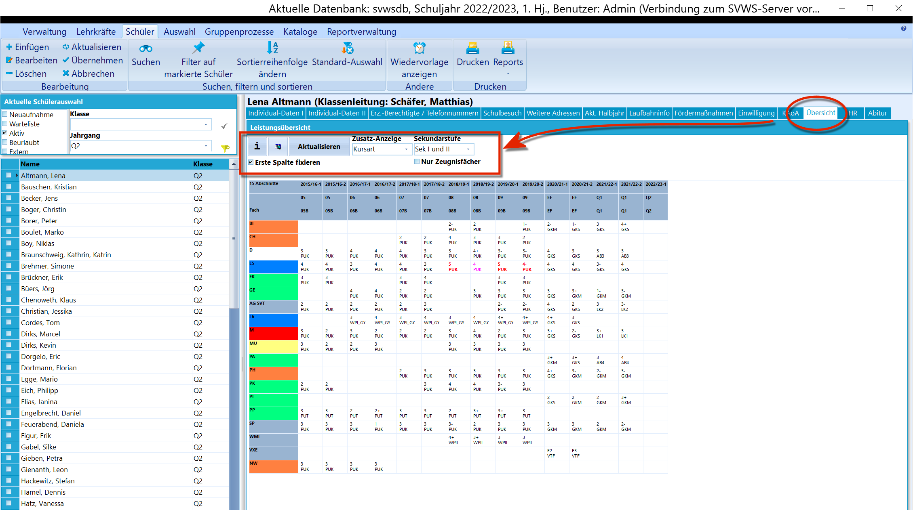
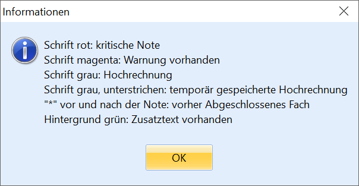

# Übersicht (Schüler)

 Der Reiter *Schüler* ➜ *Übersicht* zeigt für alle
hinterlegten Lernabschnitte alle Fächer und Kurse mit ihren jeweiligen
Endnoten.  

 Das "**i**" hält eine Erklärung der verwendeten Farben
bereit.Hinter dem Symbol daneben verbirgt sich ein **Export nach Excel**. Bei
einem Klick öffnet sich eine Vorschau, mit "**Speichern**" kann dann
eine Datei gespeichert werden.**Aktualisieren** lädt die Leistungsdaten erneut, sollten diese
zwischenzeitlich verändert worden sein.Bei der **Zusatz-Anzeige** kann gewählt werden, ob zu jedem Fach/Kurs
die *Kursart* oder *Fachlehrer* in der Tabelle eingeblendet werden
sollen.**Sekundarstufe** lässt anwählen, ob nur die *Sek I*, nur die *Sek II*
oder beide Sekundarstufen (Standardeinstellung) angezeigt werden soll.Wurde *Sek II* gewählt, erscheint ein weiteren Dropdown-Menü, in dem
sich auswählen lässt, ob die Notenangezeige *Noten* oder *Punkte*
angeben soll.Weiterhin die Spalte mit den Fächern/Kursen über **Erste Spalte
fixieren** festgestellt werden, so dass nur die folgenden Spalten
horizontal gescrollt werden.**Nur Zeugnisfächer** zeigt eben nur die Fächer an, die in der
Facheinstellung als Zeugnisfächer markiert sind.