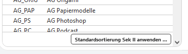
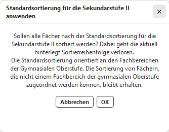

# Fächer# Ansicht

Hier werden die Fächer mit ihren in SchildNRW hinterlegten Eigenschaften
angezeigt. Diese können hier auch berarbeitet werden.  

## Reihenfolge

Die Reihenfolge der Fächer kann bzgl. der hinterlegten **Reihenfolge für
die Sek II** übernommen werden.  
Das ist insbesondere für eine sinnvolle **Reihenfolge in den
Beratungsbögen** der Laufbahnplanung wichtig.

