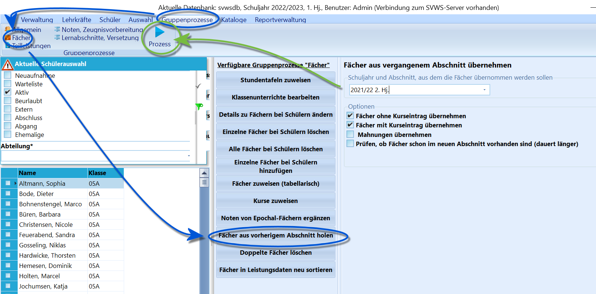

# Fächer aus vorherigem Abschnitt holen (Gruppenprozesse Fächer)

Mit dem Gruppenprozess **Fächer aus vorherigem Abschnitt holen** ist es
möglich, Fächer nachträglich in den aktuellen Abschnitt zu übernehmen.Normalerweise sollten die Fächer bei Durchführung der Versetzung
beziehungsweise Übertragung in einen neuen Abschnitt ins nächste
Halbjahr übertragen werden.Sollte dies nicht gelungen sein, zum Beispiel wegen einem fehlerhaften
Eintrag bei der Fortschreibungsart, kann die Übernahme mit diesem
Gruppenprozess nachgeholt werden.

Wählen Sie *Gruppenprozesse ➜ Fächer* und dann **Fächer aus vorherigem
Abschnitt holen**.Wählen Sie den vorherigen Abschnitt, aus dem Fächer geholt werden
sollen.Durch weitere Häkchen kann man entscheiden, welche *Fächer* übernommen
werden sollen und auch, ob gesetzte *Mahnungen* mit übernommen werden.Im Falle einer Kontrolle, ob gegebenenfalls schon Einträge im aktuell
aktiven Abschnitt vorhanden sind, müssen Sie das letzte Häkchen setzen.
Der rechnerische Zeitaufwand ist hierbei natürlich erhöht.Starten Sie dann den `Prozess` mit dem Schalter in der
Gruppenprozess-Kopfzeile.