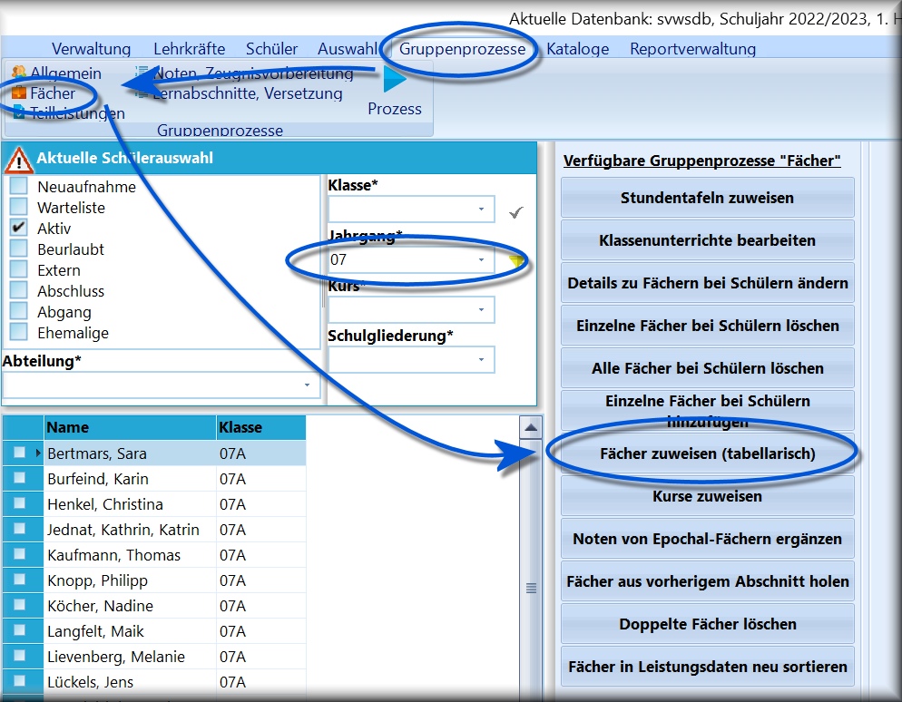
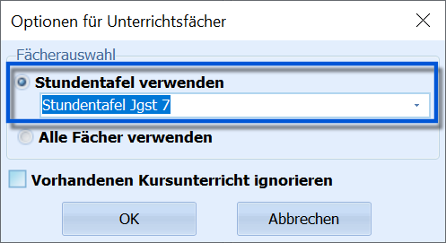
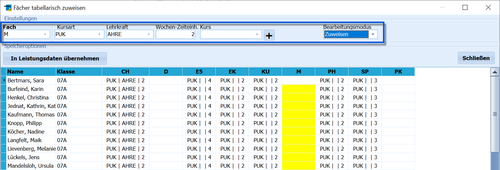
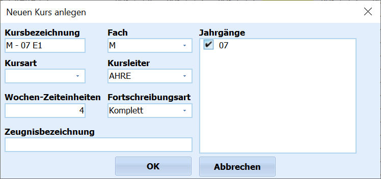

# Fächer zuweisen (tabellarisch) (Gruppenprozesse Fächer)

 Der Gruppenprozess **Fächer zuweisen (tabellarisch)** soll
die Unterrichtszuweisung bei Klassenunterricht erleichtern.Dazu muss vorher im Container die Zielgruppe gefiltert werden, z.B. eine
Klasse.Der Gruppenprozess wird über *Gruppenprozesse ➜ Fächer ➜ Fächer zuweisen
(tabellarisch)* gestartet.  

 Es erscheint ein Fenster, in dem ausgewählt werden kann, ob
für die Zuweisung nur die Fächer-   eine **Stundentafel** oder über
-   **Alle Fächer** alle verfügbaren Fächerzur Verfügung stehen sollen. Aus Gründen der Übersichtlichkeit wird zur
Verwendung einer Stundentafel geraten.Stundentafeln werden über *Kataloge ➜ Stundentafeln* definiert.Außerdem kann festgelegt werden, ob Unterricht, der bei den SuS bereits
als Kurs eingetragen ist, angezeigt werden soll.  

 Nun werden alle Schülerinnen und Schüler als Zeilen und
alle Fächer als Spalten in einer Tabelle dargestellt.Falls schon Belegungen vorhanden sind, werden diese mit aufgeführt.In der obersten Zeile, im Screenshot blau markiert, wird nun gewählt,
welches Fach mit welchen Informationen befüllt werden soll.Als Standard-Bearbeitungsmodus ist oben rechts **Zuweisen** eingestellt.Es steht weiterhin der Modus **Löschen** zur Verfügung, über den
Zuweisungen entfernt werden können.Zuerst ist im Kopfbereich des Fensters das *Unterrichtsfach* auswählen
und die weiteren Eintragungen für *Kursart*, die *Lehrkraft* und die
*Wochenzeiteinheiten* vornehmen.

Die Spalte des ausgewählten und damit zu bearbeitenden Faches wird nun
in der Tabelle gelb hinterlegt.Um das Fach mit den weiteren Angaben bei allen Schülern einzutragen, ist
die **Spaltenüberschrift** anzuklicken. Die Daten werden nun ausgefüllt.Soll ein Eintrag nur bei einzelnen Schülerinnen und Schülern erfolgen,
so muss in die entsprechende **Zelle** der Tabelle geklickt werden.

Die Darstellung in den Fächerspalten erfolgt in der Art "Kursart \|
Lehrkraft \| Stundenzahl", also zum Beispiel` "PUK| ABCD | 2"`Falls ein ebenfalls vorher definierter *Kurs* eingetragen ist, wird
diese Anzeige mit der " \| Kursbez." ergänzt, also zum Beispiel` "| M - 10 E1"`Sollte *Epochenunterricht* vorliegen, wird " \| E" angehängt, um dies
kenntlich zu machen.  

 Sollte der Kurs noch nicht existieren, kann er über das
**+** neben dem Dropdown-Menü *Kurs* definiert werden.  

## Löschen

Wählt man als Bearbeitungsmodus **Löschen**, ist wieder zuerst ein
*Fach* zu wählen.Danach bewirkt das *Anklicken der Spaltenüberschrift* beziehungsweise
einer einzelnen *Zelle*, dass das ausgewählte Fach bei den Schülerinnen
und Schülern gelöscht wird.Haben Sie ihre Änderungen vorgenommen, klicken Sie links über der
Tabelle auf **In Leistungsdaten übernehmen**. Andernfalls verlassen Sie
den Gruppenprozess - und verwerfen eventuelle Änderungen - über einen
Klick auf **Schließen**.