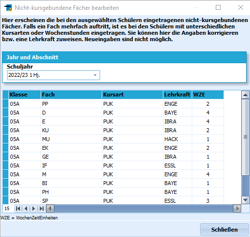

# Klassenunterrichte bearbeiten (Gruppenprozesse Fächer)

 Mit dem Aufruf des Gruppenprozesses **Klassenunterrichte
bearbeiten** erscheint das Fenster "Nicht-kursgebundene Fächer
bearbeiten".Hier wird also der Unterricht angezeigt, den die Schülerinnen und
Schüler im Klassenverband haben, daher haben die hier gezeigten Fächer
die Kursart *PUK*.

Dieser Gruppenprozess dient der Bearbeitung der *nicht-kursgebundenen
Fächer* der ausgewählten Schülerinnen und Schüler.Eine detaillierte Erläuterung ist oben in dem Fenster nachzulesen, das
hier als Screenshot abgebildet ist.