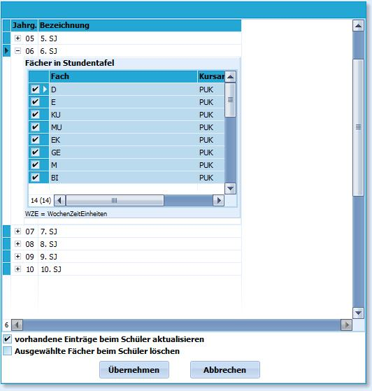

# Stundentafeln zuweisen (Gruppenprozesse Fächer)

Mit dem Aufruf des Gruppenprozesses **Stundentafeln zuweisen** erscheint
das Eingabefenster *Stundentafel auswählen*.

Die bereits unter **Kataloge/Stundentafeln** angelegten Stundentafeln
für die einzelnen Jahrgänge werden hier aufgelistet.Durch das Klicken auf das **+** in der Spalte Jahrgang werden die
Fächer, die der aktuell ausgewählten Stundentafel zugeordnet wurden,
angezeigt.Jedes in der Stundentafel vermerkte Fach ist ausgewählt.Sollten ein oder mehrere Fächer in diesem Schul(halb)jahr nicht
unterrichtet werden, können die entsprechenden Haken entfernt werden und
die bestimmten Fächer werden nicht übernommen.Wählt man die Option *vorhandene Einträge beim Schüler aktualisieren*
werden die mit einem Häkchen versehenen Fächer bei den ausgewählten
Schülern/Schülerinnen im aktuellen Halbjahr ergänzt, wenn sie noch nicht
vorhanden sind.Nicht mit einem Häkchen versehene Fächer werden nicht gelöscht.Mit der Option **ausgewählte Fächer beim Schüler löschen** können
mehrere Fächer auf einmal bei den ausgewählten Schülern gelöscht werden,
hierzu ist je nach Bedarf der Haken zu setzen oder zu entfernen.

Die gewählten Fächer werden je nach Einstellung mit einem Mausklick auf
`Übernehmen` bei den Schülern im aktuellen Halbjahr eingetragen oder
entfernt.