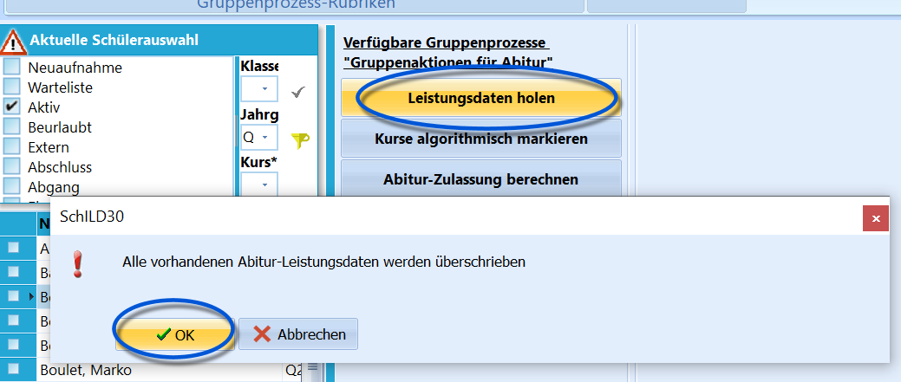
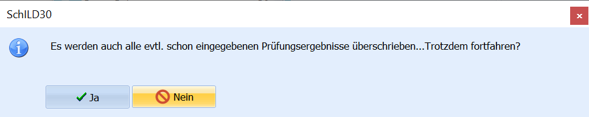

# Leistungsdaten holen (Gruppenprozesse Abitur)

 Dieser Gruppenprozess bildet die Grundlage für alle
weiteren Abitur-Gruppenprozesse und muss somit als Erstes durchgeführt
werden.
Er bildet mit den Gruppenprozessen
-   **Kurse algorithmisch markieren** und
-   **Abitur-Zulassung berechnen**einen Dreierblock, der zur Berechnung der Zulassung durchgeführt werden
muss.Liegen gegen Ende der Q2 alle Noten in den Leistungsdaten vor, so führt
dieser Prozess dazu, dass alle Noten der ausgewählten Schülermenge für
die weiteren Abiturberechnungen unter dem Karteireiter *"Abitur"* zur
Verfügung stehen.  

Dort schon vorhandene Daten werden
überschrieben.

  

Sollten nach Durchführung des Prozesses noch Änderungen
der Daten bei einzelnen Schülern vorgenommen werden, so kann man die
Aktualisierung der Daten für einen einzelnen Schüler auch unter dem
Karteireiter *Abitur* durch Klicken auf die Schaltfläche
`Leistungsdaten holen` durchführen.

