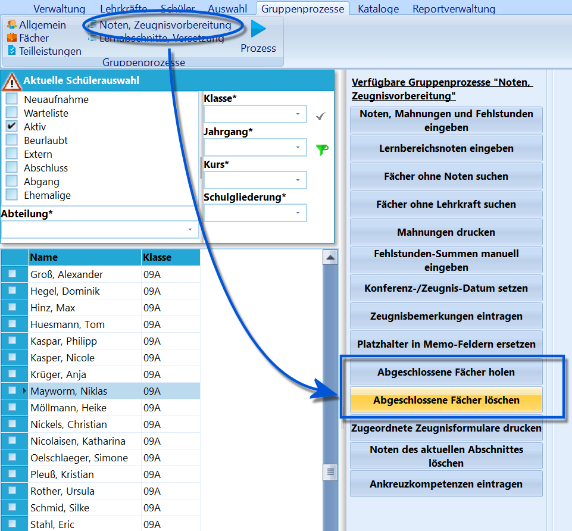
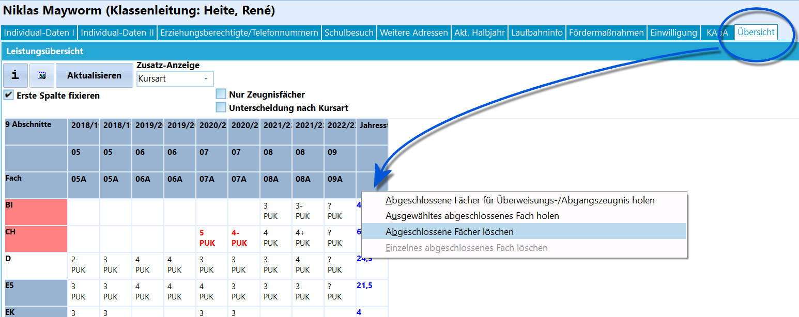

# Abgeschlossene Fächer löschen (Gruppenprozesse Noten, Zeugnisvorbereitung)

 Dieser Gruppenprozess dient dem Löschen der über
*"Abgeschlossene Fächer holen"* zusätzlich eingetragenen abgeschlossenen
Fächer - beziehungsweise deren Noten.Der Gruppenprozess löscht diese Fächer im aktiven Abschnitt
(Halbjahr).  

. Sollen nur bei einem einzelnen Schüler die abgeschlossenen
Fächer gelöscht werden, kann man über *Schüler ➜ Übersicht* durch einen
Rechtsklick in die letzte Spalte zwischen zwei Löschmöglichkeiten
wählen:-   *Abgeschlossene Fächer löschen*
-   *Einzelnes abgeschlossenes Fach löschen*Weiterhin können über dieses Kontextmenü abgeschlossene Fächer geholt
werden.