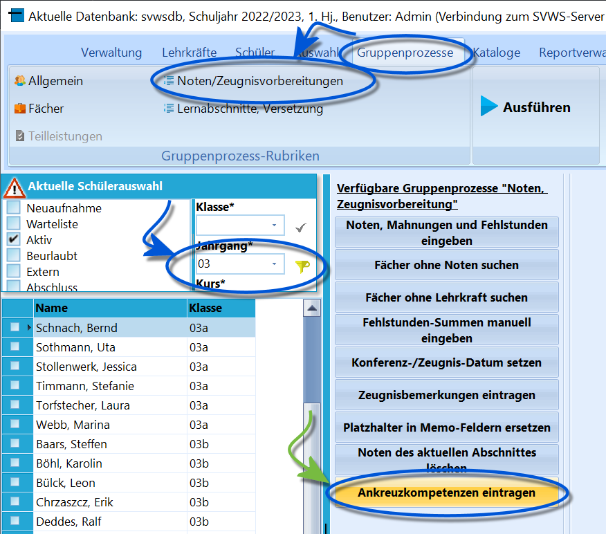
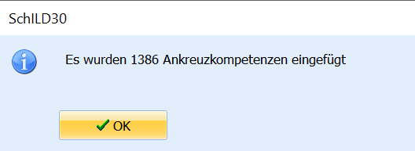

# Ankreuzkompetenzen eintragen (Gruppenprozesse Noten, Zeugnisvorbereitung)

 

Über *Gruppenprozesse ➜ Noten/Zeugnisvorbereitung ➜*
**Ankreuzkompetenzen eintragen** können vorbereitete Ankreuzkompetenzen
bei Schülern Gruppenweise eingetragen werden.Hierzu müssen folgende Bedingungen erfüllt sein
1.  Die *Klasse* muss über *Kataloge* ➜ **Klassen-/Versetzungstabelle**
    für Ankreuzkompetenzen konfiguriert sein. Setzen Sie hier den Haken
    bei **In dieser Klasse werden Ankreuzkompetenzen verwendet**.
2.  Unter *Kataloge ➜* **Angaben für Ankreuzzeugnisse** müssen die
    Ankreuzkompetenzen für die entsprechenden *Jahrgänge* und *Fächer*
    hinterlegt sein.
3.  Den *Schülern* müssen individuell die entsprechenden *Fächer*
    zugeordnet sein. Dies wird in der Regel über *Stundentafeln* und die
    entsprechenden Gruppenprozesse durchgeführt.Wählen Sie nun die Gruppe im Schülercontainer aus, die mit
Ankreuzkompetenzen bewertet werden soll und starten Sie den
Gruppenprozess mit einem Klick auf `Ankreuzkompetenzen eintragen`.Nun können die Kompetenzen unter *Schüler ➜ Akt. Halbjahr* ➜
**Kompetenzen für Ankreuzzeugnisse** angehakt werden und über einen
geeigneten Report gedruckt werden.

Beachten Sie, dass Ankreuzkompetenzen über die
entsprechenden Fach- und Schulkonferenzen festgelegt
werden.

