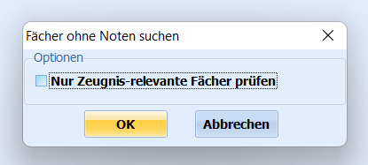
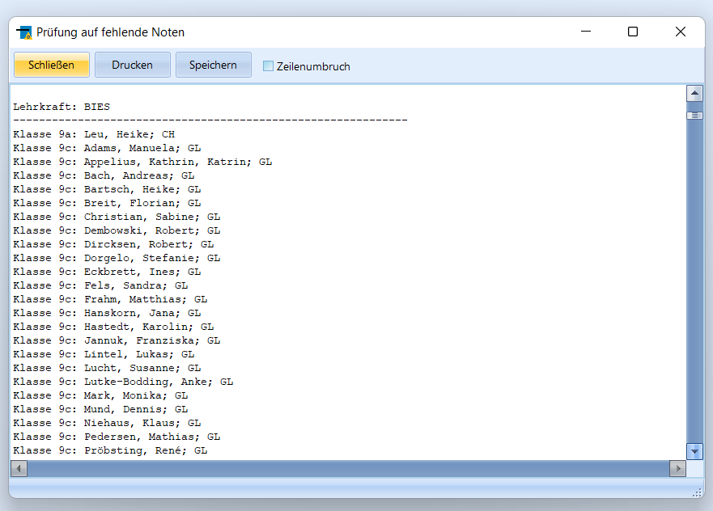

# Fächer ohne Noten suchen (Gruppenprozesse Noten, Zeugnisvorbereitung)

Über den Menüpunkt **Fächer ohne Noten suchen** kann im aktuellen
Abschnitt nach Fächern ohne Noteneintrag gesucht werden. Es empfiehlt
sich, diesen Gruppenprozess vor den Laufbahnkonferenzen, insbesondere
vor den Zeugniskonferenzen bzw. dem Zeugnisdruck selbst, zu starten, um
die Vollständigkeit der Noteneinträge zu prüfen.

Im sich öffnenden Fenster wird abgefragt, ob nur die
**zeugnisrelevanten** oder alle Fächer überprüft werden sollen. (Ein
Fach kann vor der Zuweisung über den Katalog Unterrichtsfächer als
zeugnisrelevant markiert werden.Nachträglich kann dies auch über den aktuellen Abschnitt des Lernenden
oder als *Gruppenprozess ➜ Fächer* ➜ **Details zu Fächern bei Schülern
ändern** angepasst werden.  

 Die im Fenster **Prüfung auf fehlende Noten** erstellte
Liste der fehlenden Noteneinträge wird nach Lehrerkürzeln in
alphabetischer Reihenfolge sortiert und kann gespeichert oder
ausgedruckt werden. Die Reihenfolge der Sortierung ist` Klasse aufsteigend,`  
` Nachname [alphabetisch],`  
` Vorname [alphabetisch],`  
` Fach [alphabetisch])`