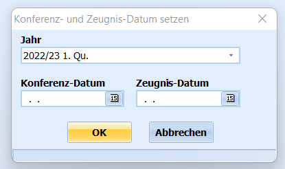

# Konferenz-/Zeugnis-Datum setzen (Gruppenprozesse Noten, Zeugnisvorbereitung)

 Dieser Gruppenprozess ermöglicht das automatische Setzen
des **Konferenz- und Zeugnisdatums** im ausgewählten Lernabschnitt.