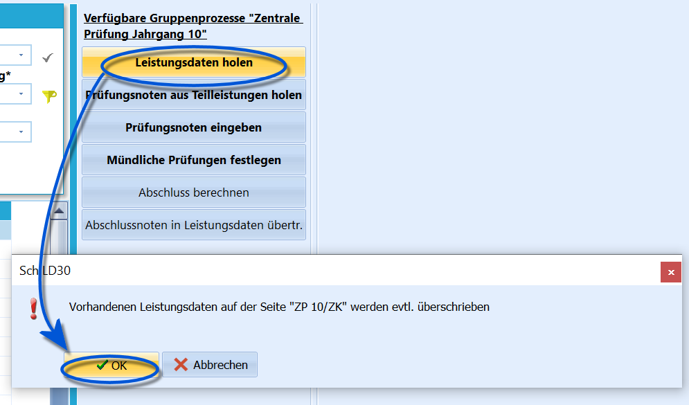
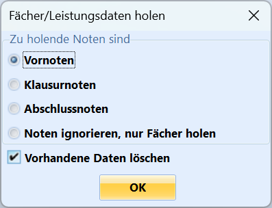

# Leistungsdaten holen (Gruppenprozesse Zentrale Klausuren)

Zu Beginn sind die Leistungsdaten des Reiters *Schüler ➜ ZP 10/ZK* zu
befüllen.Üblicherweise bedeutet dies zu Beginn des ZP 10-Prozesses, dass die in
den Leistungsdaten des *aktuellen Abschnitts* eingetragenen Noten der
Fächer als eben diese **Fächer** in den Reiter *ZP 10/ZK* geholt werden
und dass die **Note** des *aktuellen Abschnitts* als **Vornote** für die
ZP übernommen wird.  

 Beim Import ist zu entscheiden, als welche Notenart die
eingetragenen *Note* im *aktuellen Abschnitt* aufzufassen ist.In der Regel dürfte aus der im *aktuellen Abschnitt* aufgrund der
erbrachten mündlichen und schriftlichen Leistung schon gegebenen Note
die *Vornote* werden.Weiterhin lässt der Haken entscheiden, ob *Vorhandene Daten löschen*
angehakt ist, in diesem Fall werden schon gemachte Eintragungen bei im
Reiter *Schüler ➜ ZP 10/ZK* beim Import überschrieben.Wenn Sie *Noten ignorieren, nur Fächer holen* anwählen, werden nur die
Fächerstrukturen bei den Schülern angelegt, ohne auch Noten einzutragen.
Diese Schaltfläche kann genutzt werden, um vor dem Holen von Noten
sicher zu gehen, dass die Fächer auch alle angelegt sind.  
Wollen Sie die ZP-Teilnoten in den Reiter *ZP 10/ZK* holen, wird der
folgende Gruppenprozess verwendet, wenn diese Noten als Teilleistungen
erfasst wurden.