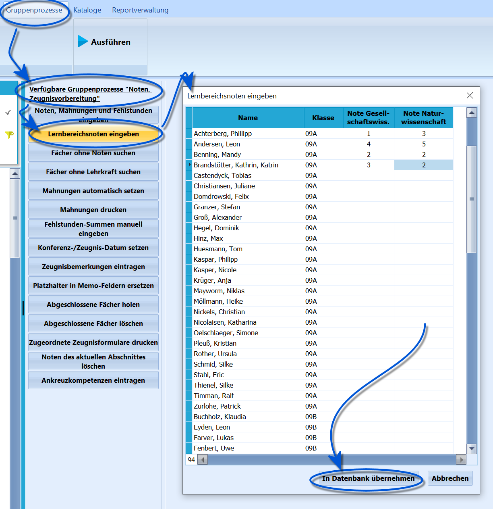

# Lernbereichsnoten eingeben (Gruppenprozesse Noten, Zeugnisvorbereitung)

 Der *Gruppenprozess ➜ Noten, Zeugnisvorbereitung* ➜
**Lernbereichsnoten eingeben** ist geeignet, um die für den
*Hauptschulabschluss* relevanten Lernbereichsnoten für eine größere
Schülergruppe einzugeben.Es öffnet sich eine Liste mit den auswählten Schülern im
Schülercontainer.Tragen Sie die Lernbereichsnoten ein und klicken Sie dann auf
`In Datenbank übernehmen`.Ein Klick auf `Abbrechen` beendet den Dialog, ohne Änderungen an der
Datenbank auszuführen.Ohne den Gruppenprozess können Lernbereichsnoten für jeden Schüler
einzeln im unteren Bereich auf der Karteikarte *Schüler ➜ Akt. Halbjahr
➜ Allgemein* eingegeben werden.