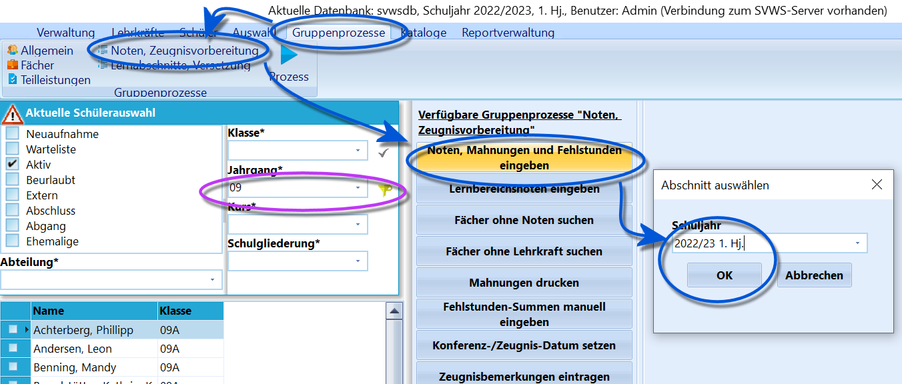
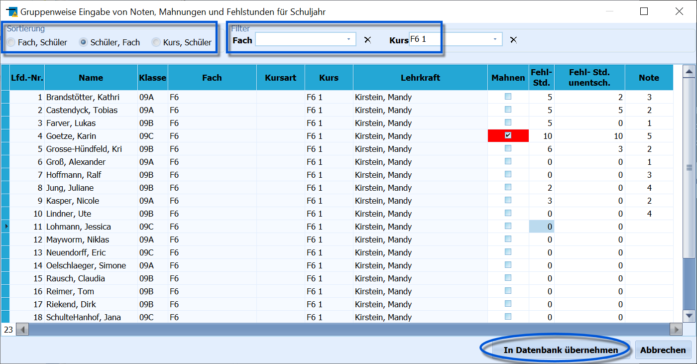
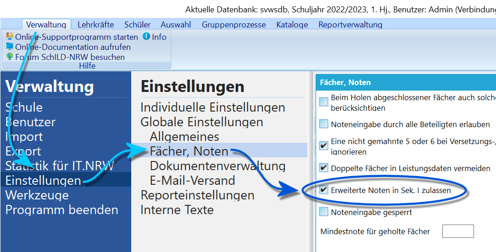

# Noten, Mahnungen und Fehlstd. eingeben (Gruppenprozesse Noten, Zeugnisvorbereitung)

 Dieser Gruppenprozess ermöglicht es, für eine größere
Schülermenge Noten, Mahnungen oder Fehlstunden einzugeben.Über eine Filterung im Container kann schon eine Vorauswahl der zu
bearbeitenden Schüler getroffen werden, zum Beispiel auf einen Jahrgang
oder eine Klasse. Diese Auswahl wird dann im Prozess selbst nach Wahl
noch verfeinert.Zuerst werden Schuljahr und der Abschnitt abgefragt, für den die
Eingaben vorgenommen werden sollen.  

Es öffnet sich für die ausgewählte Schülermenge die Eingabemaske. Man
kann dort aus drei *Sortierreihenfolgen* auswählen:1.  zuerst nach dem Fach, dann dem Schüler (geeignet für die Eingabe der
    fehlenden Noten in einem Fach, von dem man die Noten auf einer Liste
    vorliegen hat.)
2.  zuerst nach dem Schüler, dann dem Fach (hier erhält man auf einen
    Blick Informationen zu den Schülern in allen Fächern)
3.  zuerst nach einem Kurs, dann nach den Schülern (entspricht im
    Prinzip der Sortierung Fach, Schüler)Zusätzlich werden auch noch weitere *Filtermöglichkeiten* angeboten.
Diese sind sehr praktisch, um Eintragungen für einen Kurs vorzunehmen.  Das Setzen der Häkchen bei den *Mahnungen* erfolgt durch einen
Doppelklick, die Eintragungen bei den *Fehlstunden* (FSG=Fehlstunden
gesamt, FSU=Fehlstunden unentschuldigt) und den Noten durch Klick auf
das entsprechende Tabellenfeld. Die Noten können auch aus dem
Dropdown-Menü ausgewählt werden.In der Sekundarstufe II kann durch einen Klick auf den Spaltentitel
*Noten* auf eine Eingabe und Anzeige von *Punkten* umgeschaltet werden.In Jahrgängen, in denen keine Mahnungen vorgesehen sind, z.B. in der
Qualifikationsphase, wird die Spalte *Mahnen* nicht angezeigt.Nach Abschluss der Eingabe werden die Daten durch Kick auf die
Schaltfläche `In die Datenbank übernehmen` gespeichert.`Abbrechen` verlässt dieses Fenster, ohne Änderungen in die Datenbank zu
übernehmen.  

 Möchten Sie in der Sekundarstufe I *Noten mit Tendenz*
geben, können Sie diese Möglichkeit über *"Verwaltung Einstellungen
Fächer, Noten"* mit dem Haken in dem Kasten *Fächer, Noten* bei
**Erweiterte Noten in Sek. I zulassen** ermöglichen.