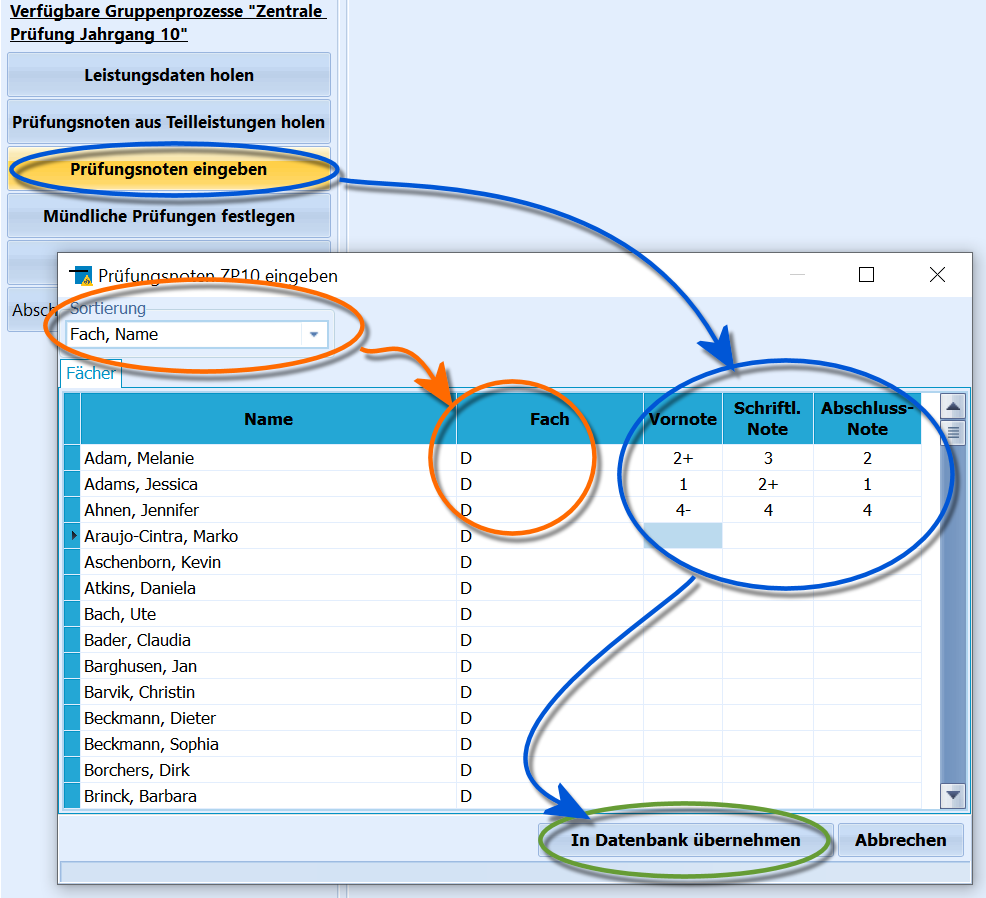

# Noten eingeben (Gruppenprozesse Zentrale Klausuren)

Die Noten können auch direkt eingegeben werden, so dass keine
Teilleistungen erfasst werden müssen. Hierzu dient der Gruppenprozess
**Prüfungsnoten eingeben**.Zuerst müssen die Leistungsdaten bei den Schülern im Reiter *Schüler ➜
ZP 10/ZK* vorliegen. Hierzu ist der Gruppenprozess *Leistungsdaten
holen* zuerst auszuführen.Nun ist auf die Gruppe zu filtern, für die der Gruppenprozess
**Prüfungsnoten eingeben** ausgeführt werden soll.  
Bei der **Sortierung** kann gewählt werden, ob erst nach *Fach* und dann
nach *Name* oder erst nach *Name* und dann nach *Fach* sortiert wird.

Dieser erste Fall ist im Screenshot zu sehen. Im zweiten Fall könnte die
Liste so aufgebaut sein:
` Adam, Melanie, D`  
` Adam, Melanie, E`  
` Adam, Melanie, M`  
` Adams, Jessica, D`  
` Adams, Jessica, E`  
` Adams, Jessica, M`und so weiter.Tragen Sie die Noten wie vorliegend und benötigt ein, klicken Sie dann
auf `In Datenbank übernehmen`.Ein Klick auf `Abbrechen` beendet den Gruppenprozess, ohne dass
Änderungen an der Datenbank vorgenommen werden und eventuell hier
vorgenommene Eintragungen werden verworfen.