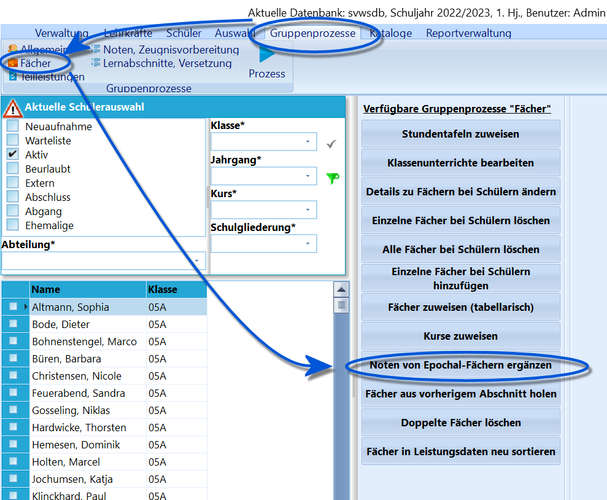
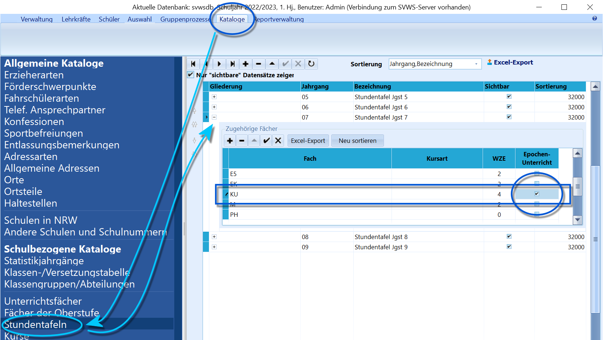

# Noten von Epochal-Fächern ergänzen (Gruppenprozesse Fächer)

Dieser Gruppenprozess ermöglicht das einfache Ergänzen von
Epochal-Fächern im aktuellen Abschnitt. Unter Epochal-Fächern versteht
man die Fächer, die nur in einem Halbjahr unterrichtet werden.

 Starten Sie ihn über *Gruppenprozesse ➜ Fächer ➜ Noten von
Epochal-Fächern ergänzen.  

 Damit der Gruppenprozess richtig arbeitet, müssen diese
Fächer im*vorangehenden'' Abschnitt entsprechend gekennzeichnet sein.

Dies wird eingestellt, indem das Häkchen in der Spalte
"Epochen-Unterricht" gesetzt wird. Damit diese Häkchen gesetzt werden,
markiert man das Fach schon in der Stundentafel als Epochenunterricht.  Dieser Gruppenprozess ergänzt für die ausgewählte Schülermenge im
aktuellen Abschnitt - basierend auf dem vorherigen Abschnitt - sowohl
das Fach als auch die Note.