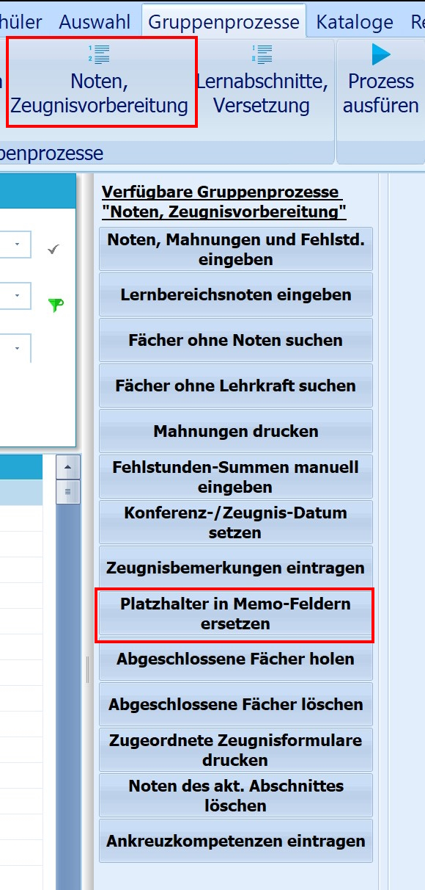

# Platzhalter in Memo-Feldern ersetzen (Gruppenprozesse Noten, Zeugnisvorbereitung)

 Beim Anlegen und Bearbeiten von Floskeln im entsprechenden
Katalog kann mit Platzhaltern gearbeitet werden (z.B. $Vorname$), die
dann nach dem Eintrag bei den Schülerinnen und Schülern automatisch vom
Programm ersetzt werden.In Einzelfällen, zum Beispiel nach dem Import einer neuen Floskelliste,
funktioniert diese automatische Ersetzung nicht.Ist dies der Fall, kann sie durch den Gruppenprozess "Platzhalter in
Memofeldern ersetzen" angestoßen werden. Dieser ist im
Gruppenprozessbereich "Noten, Zeugnisvorbereitung" zu finden.