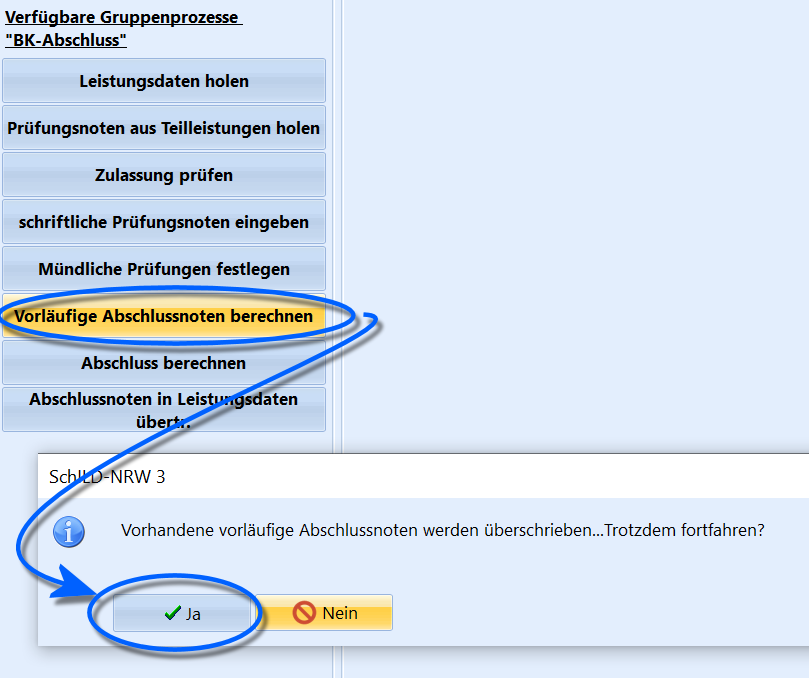

# Vorläufige Abschlussnoten berechnen (Gruppenprozesse BK-Abschluss)

Wenn bei einer ausgewählten Schülergruppe Abschlüsse und/oder
Abschlussnoten vergeben werden, die aus schon eingetragenen
Leistungsdaten oder Leistungsdaten und Prüfungsnoten ermittelt werden,
können diese Abschlussnoten über den Gruppenprozess *BK-Abschluss* ➜
**Vorläufige Abschlussnoten berechnen** ermittelt werden.

Die Noten sind im Anschluss unter *Schüler ➜ BK-Abschluss* eingetragen.

Die Abschlussnoten sind endgültig durch die hierfür verantwortlichen
Lehrkräfte entsprechend der für den Abschluss geltenden Vorgaben zu
prüfen und endgültig festzulegen.Manche Noten lassen sich nicht arithmetisch mitteln und sind daher trotz
des Gruppenprozesses von Hand einzutragen.