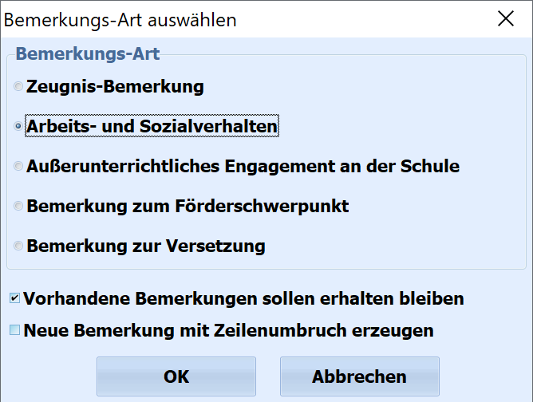
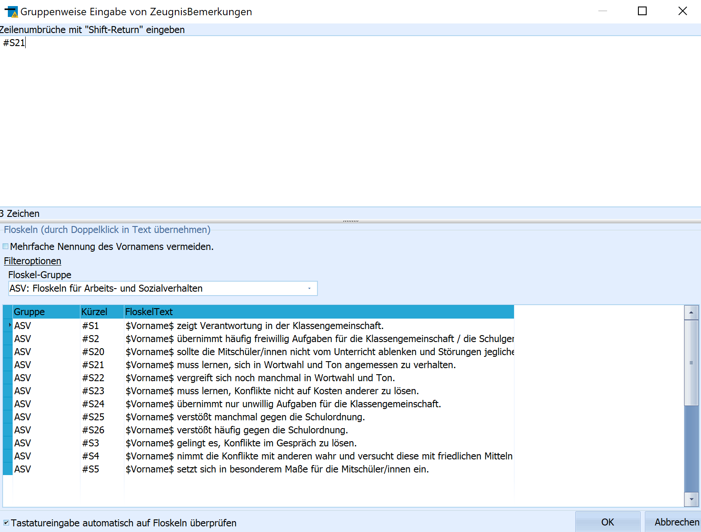

# Zeugnisbemerkungen eintragen (Gruppenprozesse Noten, Zeugnisvorbereitung)

Dieser Gruppenprozess ist geeignet, um für eine Gruppe *Bemerkungen* für
das Zeugnis einzutragen. Dies ist sinnvoll, wenn eine größere Gruppe von
Schülerinnen oder Schülern z.B. an einem Wettbewerb oder
Betriebspraktikum teilgenommen haben und dies auf dem Zeugnis
bescheinigt werden soll.

 Nach Aufruf des Prozesses muss ausgewählt werden, um welche
Bemerkungsart es sich handelt. Zur Verfügung stehen:-   Zeugnis-Bemerkung
-   Arbeits- und Sozialverhalten
-   Außerunterrichtliches Engagement an der Schule
-   Bemerkung zum Förderschwerpunkt
-   Bemerkung zur VersetzungNeben der Auswahl der Art der Bemerkung können an dieser Stelle noch
zusätzliche Einstellungen vorgenommen werden:-   vorhandene Bemerkungen sollen erhalten bleiben
-   Neue Bemerkung mit Zeilenumbruch erzeugenBestätigen Sie mit **OK** um fortzufahren.

 Im sich nun öffnenden Fenster werden die Bemerkungen
eingetragen.Hierbei können die Bemerkungen sowohl händisch, per Klick aus der unten
stehenden Floskelliste als auch durch Eingabe des Kürzels und
anschließendem Drücken der Enter-Taste eingegeben werden.

Die Übernahme der Bemerkungen erfolgt durch Klicken auf die Schaltfläche
**OK**.