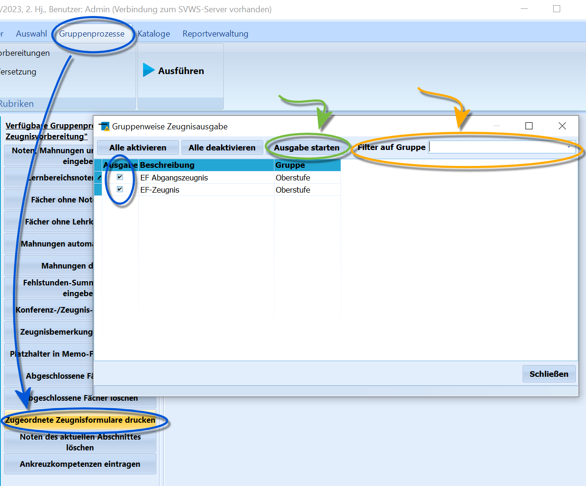
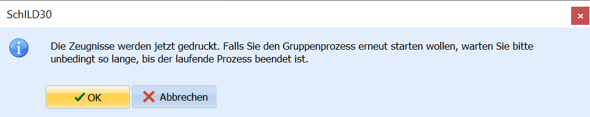
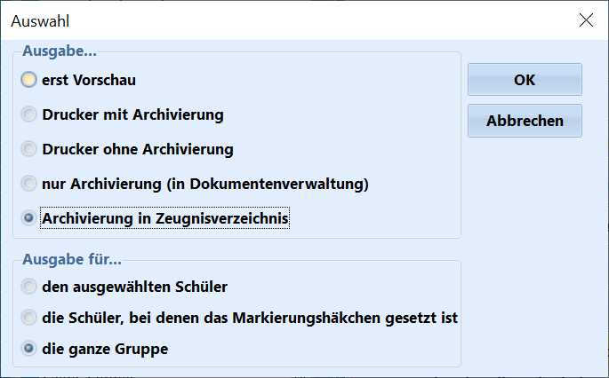

# Zugeordnete Zeugnisformulare drucken (Gruppenprozesse Noten, Zeugnisvorbereitung)

Wurden über *Kataloge ➜ Zeugnisformulare zuordnen* Zeugnis-Reports
einzelnen Jahrgängen oder Abschlüssen zugeordnet, können diese Zeugnisse
in SchILD-NRW 3 über diesen Gruppenprozess gesammelt gedruckt werden.Filtern Sie zunächst die Schülermenge, für die Zeugnisse gedruckt werden
sollen. Nutzen Sie hierzu den *Filter I*.Wechseln Sie anschließend zu *Gruppenprozesse ➜
Noten-/Zeugnisvorbereitungen ➜ Zugeordnete Zeugnisse drucken*, um den
Gruppendruck zu starten.Im Auswahlfenster werden alle Einträge aus dem Katalog angezeigt. Wenn
im Katalog Gruppen definiert wurden, kann oben rechts im Fenster nach
einer Gruppe gefiltert werden.Aktivieren Sie über die Auswahlhaken die Zeugnisse, die für die aktuell
gefilterte Schülergruppe erzeugt werden sollen. Über *Alle aktivieren*
und *Alle deaktivieren* können sämtliche Haken gesetzt oder entfernt
werden.Klicken Sie anschließend in der Kopfzeile des Fensters auf **Ausgabe
starten**, um den Druckprozess zu beginnen.

Es erscheint eine Warnmeldung, dass der Vorgang einige Zeit in Anspruch
nehmen kann. Starten Sie keine weiteren Zeugnisdruck-Gruppenprozesse,
solange der aktuelle Prozess noch läuft.

Anschließend öffnet sich der gewohnte Report-Druckdialog. Dort können
Optionen wie *Vorschau*, *Druck* und *Archivierung* ausgewählt werden.Achten Sie darauf, dass der Druck für **die ganze Gruppe** aktiviert
ist.