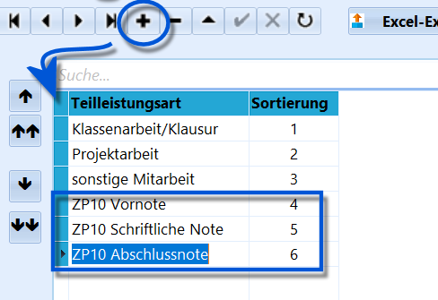
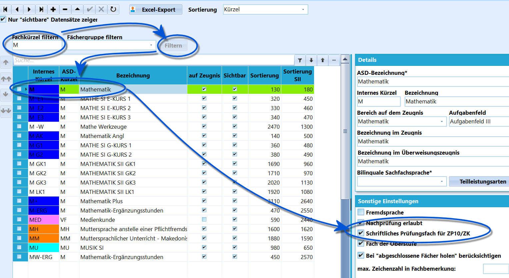
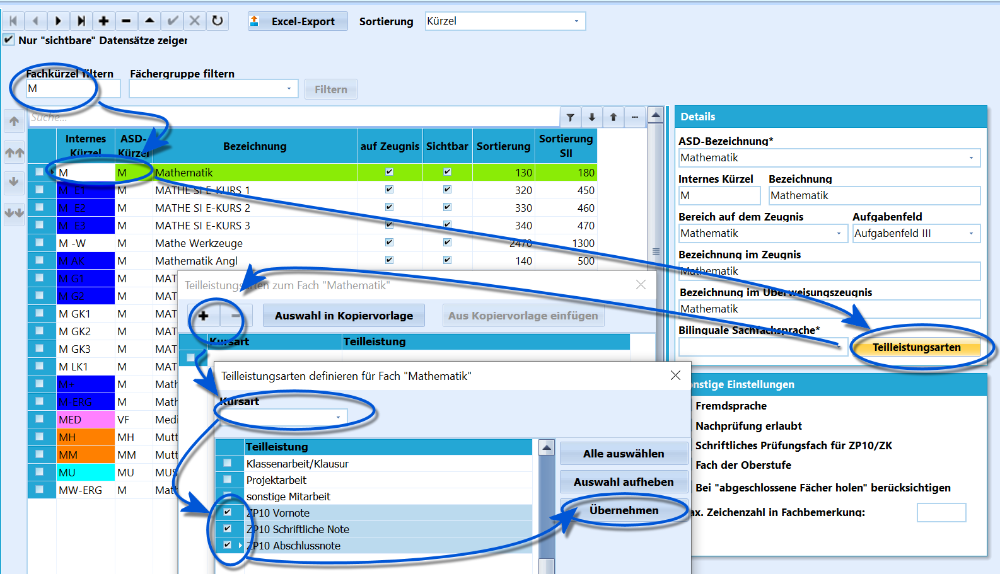
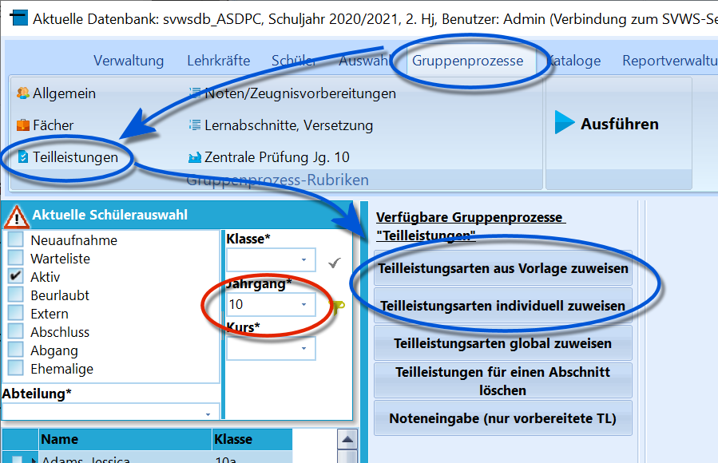
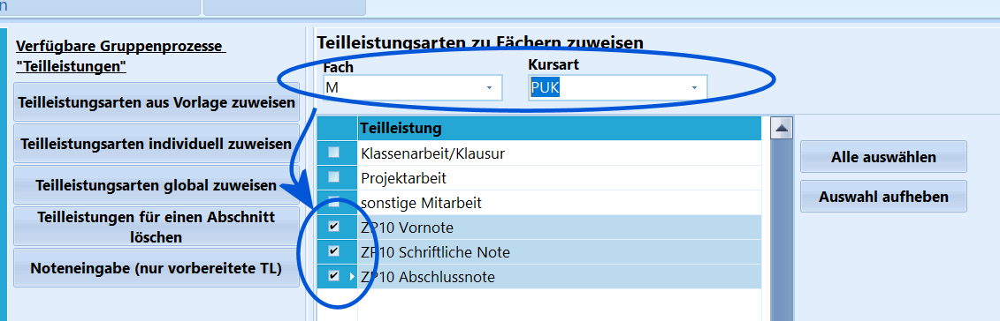
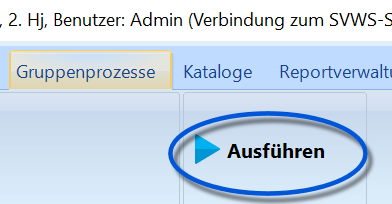

# Fächer und Teilleistungen für ZP 10 und ZK (Tutorial)

Bitte nehmen Sie das generelle Tutorial zur Einrichtung
von Teilleistungen zur Kenntnis.Der generelle Ablauf der ZP wird im Wiki-Artikel zum Reiter **Schüler ➜
ZP 10/ZK** detailliert erläutert.

Sollen ZP 10 und Zentrale Klausuren über SchILD-NRW erfasst und mittels

der mitgelieferten Funktionen verarbeitet werden, sind hierfür die
Fächer vorzubereiten und ihnen müssen passende Teilleistungen zugeordnet
werden.

## Konfiguration der Kataloge

## Anlegen der Teilleistungen

Bevor Teilleistungen einem Fach zugeordnet werden können, müssen diese
über **Kataloge ➜ Teilleistungsarten** angelegt werden.Für die ZP 10 ist eine *Vornote*, eine *Schriftliche Note* und eine
*Abschlussnote* zu erfassen.

Die hier verwendeten Bezeichnungen sind beliebig zu wählen, sie sollten
aber eindeutig und leicht erkennbar gewählt werden. Hier im Beispiel
wurde die Zuordnung der Teilleistungen durch das Präfix *"ZP 10 "*
kenntlich gemacht.  

## Unterrichtsfächer konfigurieren

 Wählen Sie das in **Kataloge ➜ Unterrichtsfächer** das
Fach, das Teil der ZP 10 oder einer Zentralen Klausur ist.Hierzu kann auch auf ein Fach oder eine Fachgruppe gefiltert werden.Über die Haken rechts bei *Sonstige Einstellungen* wird gesetzt, ob ein
Fach ein **Schriftliches Prüfungsfach für ZP 10/ZK** ist.Weiterhin kann angehakt werden, ob nach der Prüfungsordnung eine
**Nachprüfung** erlaubt ist. Für die ZP 10-Fächer gilt dies.Wiederholen Sie diesen Vorgang für alle relevanten Fächer.  

## Zuweisen der Teilleistungen zu den Fächern

 Nachdem die Fächer als Fächer der ZP 10/ZK markiert wurden
und die Teilleistungen im Katalog definiert wurden, lassen sich die
Teilleistungsarten nun den Fächern konkret zu weisen.In **Kataloge ➜ Unterrichtsfächer** ist das passende Fach zu wählen,
dann findet sich unter *Details* die Schaltfläche `Teilleistungsarten`.Wurde diese angeklickt, sind alle diesem Fach zugeordneten
Teilleistungsarten zu sehen. Ein Klick auf das `+` lässt uns die
definierten *Teilleistungsarten* wählen.Eventuell müssen Sie einmal auf *'Kursart* klicken und die passende
Kursart auswählen, um alle Teilleistungsarten angezeigt zu bekommen. Bei
Unterrichts im Klassenverband handelt sich sich um *PUK*. Auch eine
"leere" Kursart kann gewählt werden.Setzen Sie nun die *Haken* bei den Teilleistungsarten, die für die ZP 10
oder die Zentrale Klausur definiert wurden.Klicken Sie auf `Übernehmen`.

Wiederholen Sie diesen Vorgang für alle relevanten
Fächer, bei der ZP 10 sind dies Deutsch, Mathematik und
Englisch.

## Die Teilleistungsarten den Leistungsdaten bei den Schülern zuordnen

Nun sind die Fächer und Teilleistungsarten für die Schule vorbereitet,
sie müssen jedoch noch den Schülern konkret in ihren Leistungsdaten
zugewiesen werden, damit die Teilleistungen aufgenommen werden können.

Es ist zuerst der *Jahrgang 10* auswählen, dann können die
Teilleistungen über den Gruppenprozess **Teilleistungsarten aus Vorlage
zuweisen** zugewiesen werden.Sie sind damit dann bei den konfigurierten Fächern (D, M, E) angelegt
und können nun in SchILD-NRW befüllt werden.  

### Optional: Individuell konfigurierte Zuordnung von Teilleistungen

 Sollen einzelne Teilleistungen nachgetragen werden oder
muss in einer Datenbank bei unter (Unter-)Schülergruppe eine
individuellere Steuerung in Bezug auf Fächer und Teilleistungen
vorgenommen werden, hilft der Gruppenprozess **Teilleistungsarten
individuell zuweisen**.  

 Klicken Sie oben auf `Ausführen`, um den konfigurierten
Gruppenprozess zu starten.