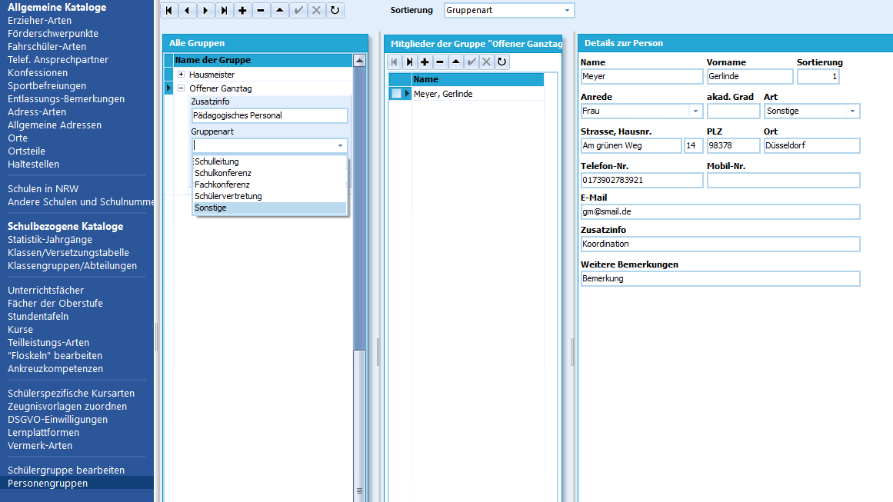
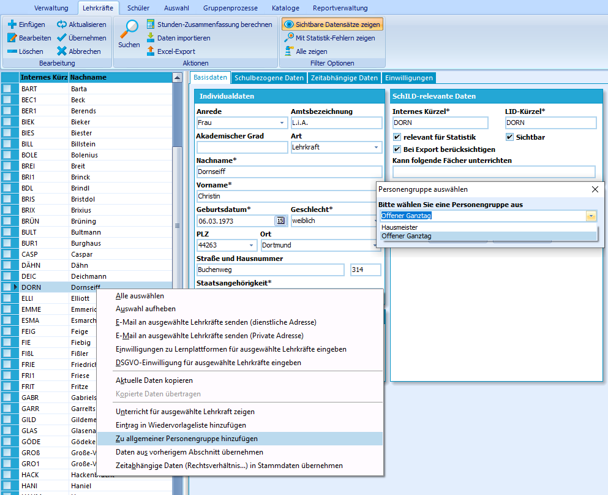
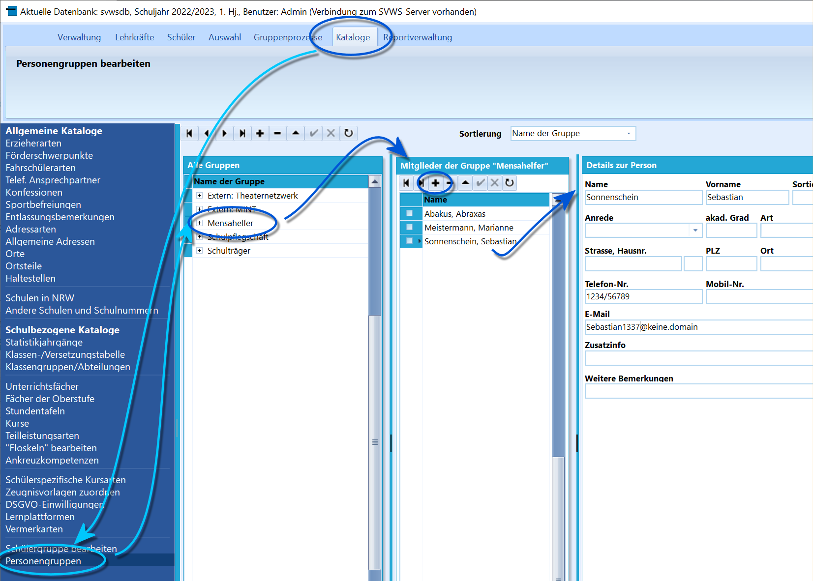

# Personengruppen (Schulbezogene Kataloge)Hier angelegten 
**Personengruppen** können beliebige Personen zugewiesen
werden, bei denen es sich nicht um Schülerinnen und Schüler, Eltern oder
Lehrkräfte handeln muss. So können weitere Beschäftigte der Schule
verwaltet werden als auch weitere Personen, deren Kontaktdaten für die
Schule wiederkehrend wichtig sind.

Die Personengruppen können dabei sowohl individuell benannt als auch
zusammengesetzt werden. So können bereits bekannte Schülerinnen und
Schüler, Eltern und Lehrkräfte den Personengruppen hinzugefügt werden
als auch neue Personen angelegt und hinzugefügt werden.Für SchILD-NRW *bekannte Personen* geschieht das über einen
*Rechtsklick* auf ihren Namen und die Auswahl **Zu allgemeiner
Personengruppe hinzufügen** aus dem erscheinenden Kontextmenü.  

## Anlegen neuer Personengruppen

 Durch Klick auf das "**+**" in der oberen Bedienfeldleiste
kann eine neue Personengruppe angelegt werden.Direkt neben dem "+" in der Übersicht *Alle Gruppen* unter der Leiste
wird die entsprechende Bezeichnung der Gruppe eingetragen.Nach einem Klick auf das "+" neben dem Namen der Gruppe erscheinen drei
weitere Felder, in die eine *Zusatzinfo* eingetragen, eine *Gruppenart*
bestimmter Personen ausgewählt und eine *Sammel-Email*-Adresse
eingegeben werden können.  

## Hinzufügen von Mitgliedern zu Personengruppen

 Die mittlere Übersicht im Beispiel erlaubt das Hinzufügen
beliebiger Mitglieder zur ausgewählten *Personengruppe*.In der rechten Übersicht können Details zur Person erfasst werden.Bekannte Personen aus den Gruppen der *Schülerschaft* und der
*Lehrkräfte* können durch einen Rechtsklick auf ihren Namen und die
Auswahl "**Zu allgemeiner Personengruppe hinzufügen**" aus dem
erscheinenden Kontextmenü zu einer angelegten Personengruppe hinzugefügt
werden.

Dies ist im Screenshot rechts gezeigt: Hier wurde eine Lehrkraft als
Verantwortliche der Personengruppe "Offener Ganztag" hinzugefügt.  

 Erziehungsberechtigte oder generell beliebige Personen
können ebenfalls Personengruppen hinzugefügt werden.

Dies geschieht direkt über *Kataloge ➜ Personengruppen*. Hier können nun
direkt *Personengruppen* definiert werden.

Diese Gruppen werden dann mit den Kontaktdaten von *Personen* befüllt.    

## Bearbeiten von Personengruppen

Durch einen Doppelklick in das entsprechende Feld in der Übersicht *Alle
Gruppen* kann die Bezeichnung bereits angelegter Personengruppen
geändert werden.Ebenso können Details der Personengruppe geändert werden, indem diese
Gruppe durch einen Klick auf das "**+**" neben dem Gruppennamen
erweitert wird.Ein Klick auf das "**-**" löscht die angelegte Personengruppe nach
Bestätigung einer Dialogabfrage.Mitglieder der Gruppe lassen sich in der mittleren Übersicht durch einen
Klick auf das "**-**" nach Bestätigung einer Dialogabfrage aus der
Gruppe entfernen.