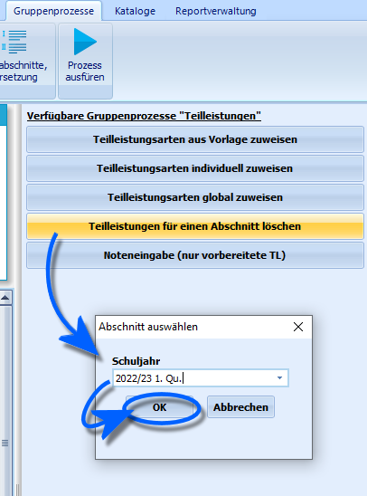

# Teilleistungen für einen Abschnitt löschen (Gruppenprozesse Teilleistungen)

 Durch den Gruppenprozess **Teilleistungen für einen
Abschnitt löschen** können für die Schülergruppe alle Teilleistungen des
aktuellen Abschnitt gelöscht werden.Ein Klick auf diesen Gruppenprozess öffnet das im Beispiel rechts
gezeigte Auswahlfenster, in dem der entsprechende Abschnitt ausgewählt
werden kann. Es können also auch für vergangene Abschnitte
Teilleistungen gelöscht werden.Nach Klick auf `OK` erfolgt eine Bestätigungsaufforderung.Danach werden für den gewünschten Abschnitt für alle im Container
ausgewählten Schüler alle Teilleistungen gelöscht.