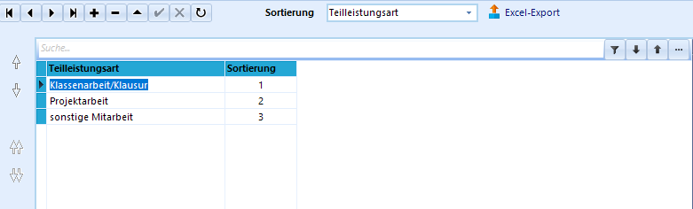
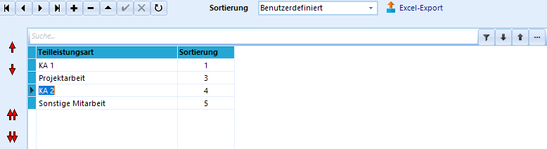

# Teilleistungs-Arten (Schulbezogene Kataloge)

**Teilleistungen** dienen zur Erfassung aller Leistungen von
Schülerinnen und Schülern, die keine Zeugnisnoten sind, die aber
entweder mit dauerhaft erfasst werden sollen oder die zur Weiterarbeit
in anderen Prozessen nützlich sind.

Die **Teilleistungsarten** können dabei individuell festgelegt werden.Übersichten der Teilleistungen können durch einen Report ausgegeben
werden und so als Grundlage für zum Beispiel pädagogische Konferenzen
dienen.Nach Festlegung der an der Schule verwendeten Teilleistungsarten in
diesem Programmfenster müssen die jeweiligen Teilleistungsarten den
entsprechenden Jahrgängen, Klassen oder Schülergruppen durch einen
*Gruppenprozess* zugewiesen werden, bevor Noten eingetragen werden
können.  

## Anlegen neuer Teilleistungsarten

 Durch Klick auf das `+` kann eine neue Teilleistungsart
angelegt werden.In der Spalte *'Teilleistungsart* wird die entsprechende Bezeichnung
eingetragen.

Die Einträge in der Spalte **Sortierung** sollten nicht manuell
verändert werden, da es sonst zu ungewünschten bzw. unerwarteten
Sortierungen kommt.Eine individuelle Sortierung wird im nächsten Abschnitt erläutert.  

## Sortierung der Teilleistungsarten

Bei Verwendung der **Sortierung** "Teilleistungsart" sortiert das
Programm alphabetisch, wobei alle Großbuchstaben vor den Kleinbuchstaben
einsortiert werden.In dieser Reihenfolge werden die Teilleistungen auch in den
entsprechenden Reports sortiert.

 Ist eine **individuelle Sortierung** gewünscht, so kann
dies eingestellt werden.

Die Pfeile am linken Rand werden damit aktiviert und erlauben eine
individuelle Reihenfolge, die so auch in Reports abgerufen werden kann.Im Screenshot dargestellt ist die Verschiebung der neu angelegten
Teilleistungsart "KA 2" ("Klassenarbeit 2").  

## Bearbeiten von Teilleistungsarten

Durch einen Doppelklick in das entsprechende Feld in der Spalte
"Teilleistungsart" kann die Bezeichnung bereits angelegter
Teilleistungsarten geändert werden.Ein Klick auf das `-` löscht die angelegte Teilleistungsart nach
Bestätigung einer Dialogabfrage.  

## Export in eine Excel-Tabelle

Durch Klick auf **Excel-Export** und `Speichern` im folgenden Fenster
kann die aktuelle Ansicht in eine Excel-Tabelle exportiert werden.