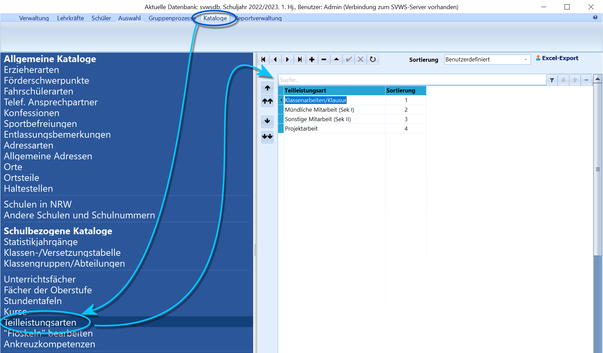
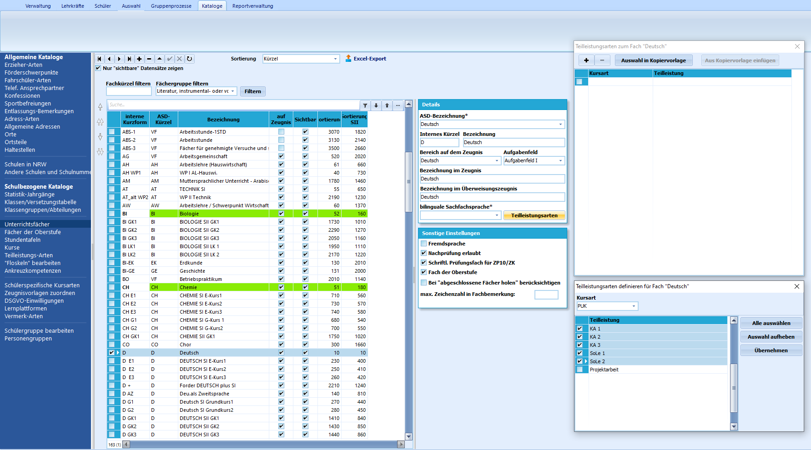
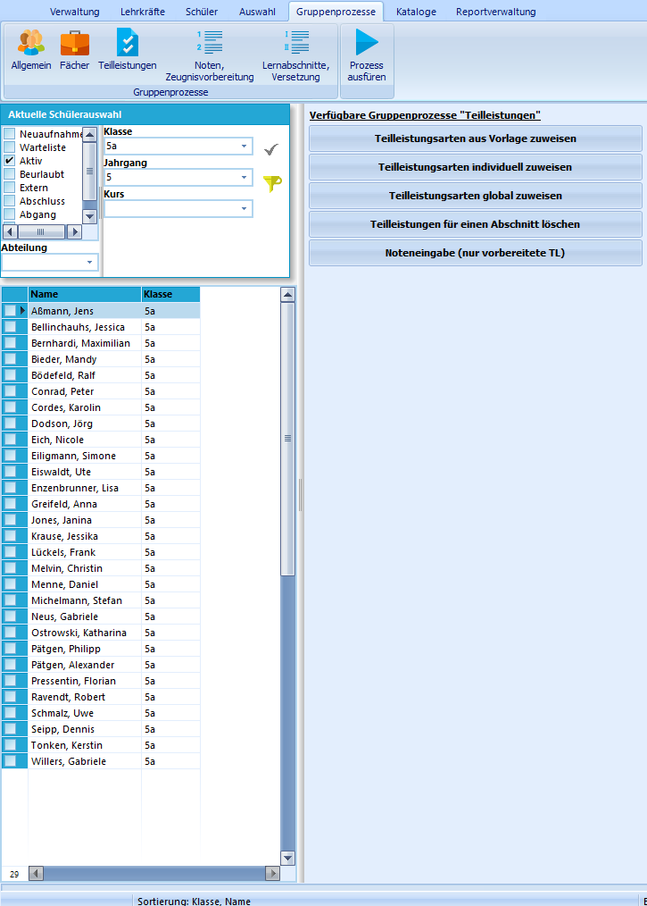
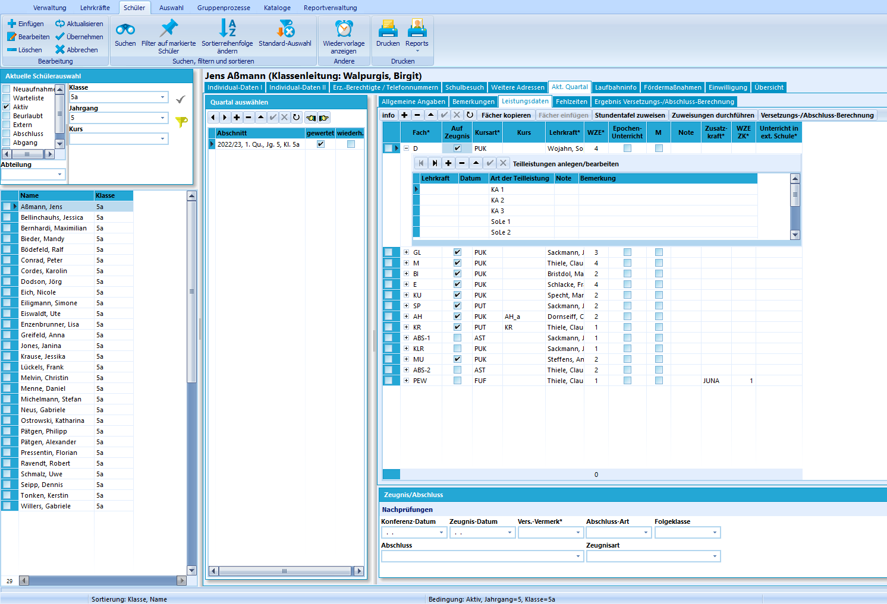

# Teilleistungsarten aus Vorlage zuweisen (Gruppenprozesse Teilleistungen)Durch diesen Gruppenprozess können der ausgewählten Schülergruppe
Teilleistungsarten aus einer Vorlage zugewiesen werden.

## VorarbeitenZuvor müssen diese Teilleistungsarten angelegt worden sein. Dies wird
über *Kataloge* ➜ **Teilleistungsarten** und den entsprechenden Fächern
in den jeweiligen Kursarten zugewiesen über *Kataloge* ➜
**Unterrichtsfächer** vorbereitet.Nachdem dieser Schritt durchgeführt wurde, können Noten für die
einzelnen Teilleistungen eingetragen werden.  

### Vorbereitung der Teilleistungsarten

 Bevor Teilleistungsarten individuellen Schülern und Kursen
zugewiesen werden können, müssen die für die Schule gewünschten
Teilleistungsarten, die erfasst und archiviert werden sollen, definiert
werden.

Die für die Schule grundsätzlich zur Verfügung stehenden
*Teilleistungen* werden über *Kataloge* ➜ **Teilleistungsarten**
angelegt.  

### Zuweisung zu den Unterrichtsfächern

 Nach Erstellung des schulspezifischen Katalogs an
Teilleistungsarten werden diese der entsprechenden Kombination aus
Unterrichtsfach und Kursart zugeordnet.Zu berücksichtigen ist hier, dass nur den ausgewählten *Kursarten* die
entsprechenden Teilleistungsarten zugeordnet werden.Wird das Fach Deutsch im Beispiel also neben dem normalen
Klassenunterricht an Schulen der Primar- und Sekundarstufe I auch zum
Beispiel im Kursverband der Oberstufe (GKM, GKS o. ä.) unterrichtet,
muss für *jede* dieser Kursarten die entsprechende Teilleistungsart aus
der Vorlage zugewiesen werden.Zur schnelleren Arbeit können Vorlagen auch kopiert und eingefügt
werden.  

## Gruppenprozess "Teilleistungsarten aus Vorlage zuweisen"

 Im Reiter Gruppenprozesse kann schließlich über die Auswahl
der Gruppe *Teilleistungen* und den Gruppenprozess **Teilleistungen aus
Vorlage zuweisen** der aktuell ausgewählten Schülermenge im Container
die vorbereiteten Teilleistungsarten zugewiesen werden.

Die Zuweisung orientiert sich dabei automatisch an der Kursart, in der
das Fach bei den Schülern unterrichtet wird.  

Im Beispiel sind den Schülern der Klasse 5a fünf vorbereitete
Teilleistungsarten zugewiesen worden, die bei Klick auf das **+** beim
Fach im *aktuellen Abschnitt* sichtbar werden.