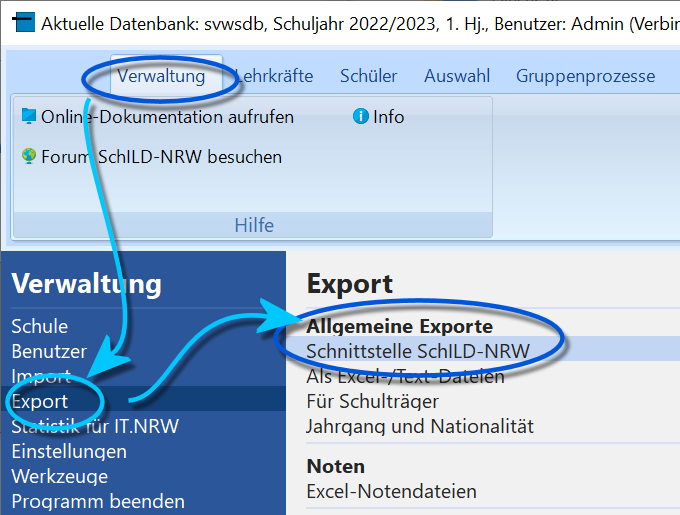
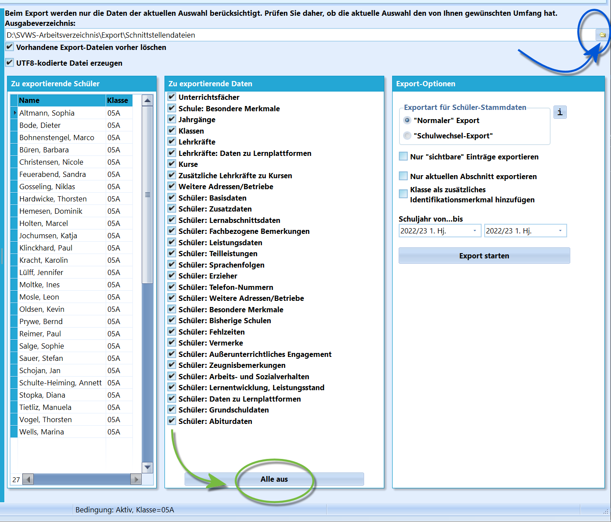
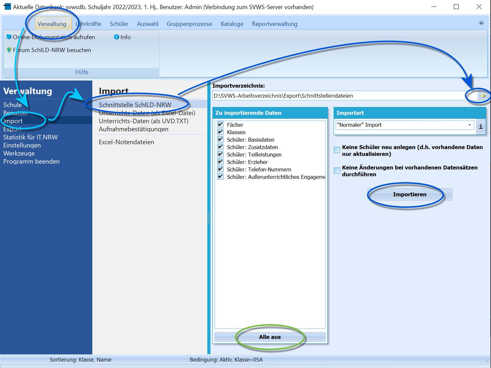
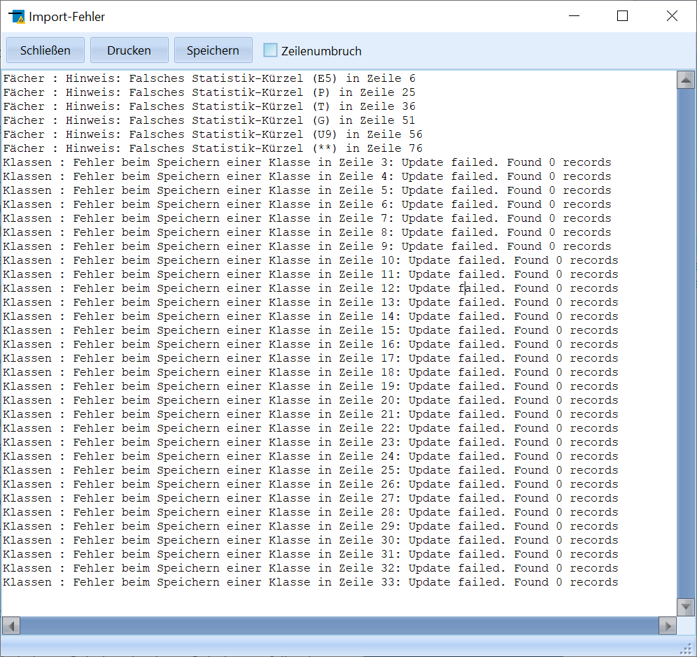

# Schnittstelle SchILD-NRW (Verwaltung Export)

### Export

 

 Über *"Export ➜ Allgemeine Exporte ➜
Schnittstelle SchILD-NRW"* öffnet sich ein Fenster, in dem festgelegt
wird, welchen Daten in Schnittstellendateien gespeichert werden.Zuerst legen Sie ein **Ausgabeverzeichnis** fest.Hier im Beispiel sollen unsere Dateien im Arbeitsverzeichnis im
Unterordner *Export\Schnittstellendateien* abgelegt werden.-   Über **Vorhandene Export-Dateien vorher löschen** ist festzulegen,
    ob im Ordner schon vorhandene Dateien gelöscht werden sollen. Diese
    Einstellung ist sinnvoll, wenn nur ein Teil der Daten exportiert
    wird. Würden existierende Dateien nicht gelöscht, könnten im Ordner
    zum einen die frisch exportierten Daten, aber auch andere, ältere
    Dateien zusammen existieren und im Laufe der nächsten Operationen zu
    Fehlern führen.<!-- -->-   Der Schalter **UT8-kodierte Datei erzeugen** legt fest, ob die
    Dateien als *ANSI* oder *UTF8 (Unicode)* kodiert werden. Für moderne
    Systeme macht es Sinn, UTF8 zu nutzen, jedoch kann es sein, dass ein
    anderes, älteres Programm, mit dem die Daten verarbeitet werden
    sollen, Unicode nicht unterstützt.Im Container *'Zu exportierende Schüler* ist die aktuelle Auswahl der
Schüler aus dem Reiter *Schüler* enthalten. Somit gilt: Die Auswahl der
Schüler mit eventuell individueller Filterung wird vor dem Export über
*Schüler* getroffen.Im Fenster **Zu exportierende Daten** werden die Schnittstellendateien
mit den gewünschten Inhalten ausgewählt.

#### Weitere Export-OptionenWeiterhin werden weitere **Export-Optionen** angeboten.-   Über **Exportart für Schüler-Stammdaten** wird gesteuert, welche
    Schule als die *Zuletzt besuchte Schule* eingetragen ist.
    -   **"Normaler" Export**: Hier werden die Daten wie in der
        Datenbank übernommen.
    -   **Schulwechsel-Export**: Hier wird die eigene Schule als
        *Zuletzt besuchte Schule* eingetragen, da die Personen ja die
        eigene Schule mit dem Schulwechsel verlassen.<!-- -->-   Der Schalter **Nur "sichtbare" Einträge exportieren** beschränkt zum
    Beispiel exportierte Katalogeinträge wie die Inhalte der *Klassen-
    und Versetzungstabelle* auf die Einträge, die im Katalog als
    sichtbar markiert sind.<!-- -->-   **Nur aktuellen Abschnitt exportieren** beschränkt die Daten auf die
    des aktuellen Abschnitts.<!-- -->-   SchILD identifiziert Schüler generell im Im- und Export über *Name,
    Vorname und Geburtsdatum*. Mit **Klasse als zusätzliches
    Identifikationsmerkmal hinzufügen** wird dieses Merkmal bei
    schülerbasierten Einträgen zusätzlich zur Verfügung gestellt.<!-- -->-   Über **Schuljahr von... bis** lassen sich der für den Export
    relevante erste und letzte Abschnitt festlegen.<!-- -->-   Wählen nach Festlegung der gewünschten Einstellungen **Export
    starten**.

### Import

Über *Verwaltung ➜ Import ➜ Schnittstelle SchILD-NRW* wird der
Importprozess gestartet.Zuerst ist ein **Importverzeichnis** zu wählen, in dem sich mit
Schnittstellendateien kompatible Dateien befinden.Nachdem ein Verzeichnis gewählt wurdem werden unter **Zu importierende
Daten** die gefundenen Dateien angezeigt. Hier im Beispiel wird
deutlich, dass im Verzeichnis nur eine Auswahl der möglichen Dateien
liegt.Wählen Sie per Haken die gewünschten Dateien an. Über **Alle aus** unter
der Liste können alle Haken entfernt werden, um dann die gewünschten neu
zu setzen.-   Unter **Importart** kann zwischen zwei Varianten gewählt werden:
    -   **Normaler Import**: Es können alle Datenarten importiert
        werden, wobei fehlende Einträge in Katalogen automatisch
        angelegt werden.
    -   **Schulwechsel-Import**: Es können nur Daten importiert werden,
        die bei einem Schulwechsel von Schülern anfallen können. Dies
        sind die Schüler-Stammdaten, Erzieherdaten, Telefonumern und
        Adressen.
-   **Keine Schüler neu anlegen** verhindert, dass unerwartet neue
    Schüler erzeugt werden. Es werden nur vorhandene Daten aktualisiert.
-   **Keine Änderungen an vorhandenen Datensätzen** aktualisiert Daten
    nicht. Damit wird nichts überschrieben, es werden nur bislang nicht
    vorhandene Datensätze angelegt beziehungsweise bislang unausgefüllte
    Felder befüllt.**Importieren** startet den Import mit den gewählten Optionen.

#### Fehlerprotokoll

 Tauchen beim Import bei einzelnen Datensätzen Fehler auf,
werden diese nun in einem Fehlerprotokoll angezeigt.

Dieses lässt sich *Drucken* oder als Textdatei *Speichern*.