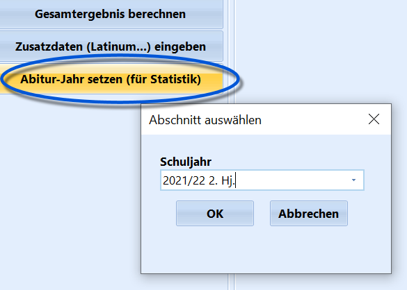

# Abitur-Jahr setzen (für Statistik) (Gruppenprozesse Abitur)

 Dieser Gruppenprozess bildet den Abschluss für die
Berechnungen in SchILD und setzt bei allen ausgewählten Schülern das
Abiturjahr.

Dies ist besonders für die Statistik und eventuell weiteren
Datenaustausch wichtig, wie zum Beispiel die richtigen Ergebnisse für
den Export der Abiturergebnisse.Der gesetzte Wert ist im Reiter *Schüler ➜ Abitur* unter **Weitere
Angaben** zu finden und kann dort auch individuell für einzelne Schüler
verändert werden.